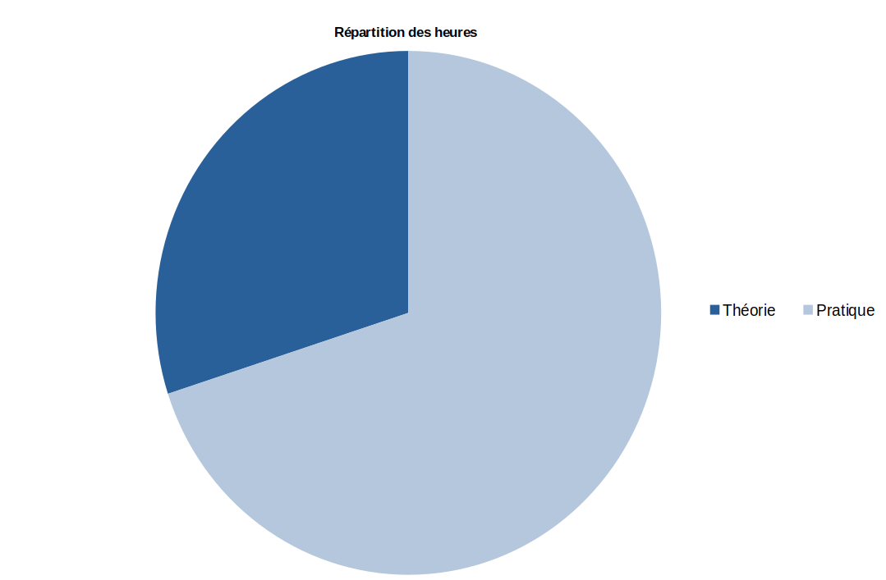
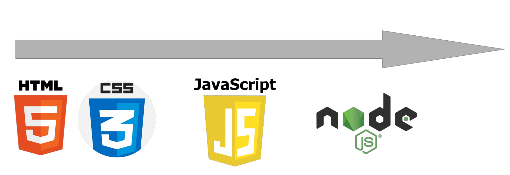

# EU09 Techniques Web

## Présentation du cours
Ce cours de développement web s'adresse aux étudiants en première année de bachelier en intelligence artificielle. Il a pour objectif de vous initier aux bases de la création et du développement d'applications web tout en établissant des liens concrets avec le domaine de l'IA. Ce cours présentera les langages qui sont à la base du web :

HTML (HyperText Markup Language) sera le point de départ, où vous apprendrez à structurer et organiser le contenu d’une page web. Nous enchaînerons avec CSS (Cascading Style Sheets) pour habiller ces pages d'un design esthétique et attrayant.

Ensuite, nous aborderons JavaScript, un langage de programmation dynamique, qui vous permettra de donner vie à vos sites web grâce à des interactions.

La seconde partie du cours sera dédiée au développement côté serveur avec Node.js, une plateforme polyvalente pour créer des backends et gérer les données échangées entre vos applications et leurs utilisateurs.

Nous explorerons également l'utilisation des API, essentielles pour connecter vos applications à des services externes, dont des API d'intelligence artificielle. Ceci vous permettra d'effectuer de petits projets de création de site web avec par exemple des chatbots intégrés.

## Objectifs du cours

Au terme de ce cours, vous serez capable de :

1. Connaitre les notions de base et les principes de fonctionnement d’Internet.
2. Élaborer une architecture de site internet (structure des pages, navigation).
3. Réaliser un site interactif en utilisant de manière adéquate les langages HTML5, CSS et javascript.
4. Interagir avec un serveur en utilisant l'environnement Node.js.
5. Intégrer des services tiers à vos sites web en utilisant des services APIs.
6. Construire des sites web avec des fonctionnalités avancées comme un chatbot.

## Organisation du cours 
Le cours se divise en un cours théorique (18 heures), où nous verrons ensemble la théorie liée au technique web et un cours de laboratoire (42 heures) dans lequel vous pourrez vous exercer et appliquer les concepts de théories au travers d'exercices et de différents mini-projets. 

<!--  -->

Nous aurons donc en moyenne deux heures par semaine de théories et quatre heures par semaine de laboratoire, sauf à la fin du quadrimestre ou nous n'auront plus que les heures de laboratoires. 

La présence au cours théorique et aux laboratoires est vivement recommandée. La correction de nombreux exercices sera effectuée lors des séances de laboratoire. De plus, vu la nature du développement web, être présent aux laboratoires vous permets également d'avoir des feedback personnalisé sur vos exercices.

En règle général, vous aurez assez de temps lors des séances de laboratoire pour terminer les exercices, mais dans le cas où vous n'aurez pas terminé certains, ils seront à terminer avant la prochaine séance. 

## Evaluation
L'évaluation de première et de seconde session se fera sous forme d'un examen. Celui-ci prendra la forme d'un examen d'exercice où vous devrez réaliser un site web en utilisant les différents langages vue (html, css, javascript, node.js). L'examen sera très largement inspiré des mini-projets, il est donc fortement conseillé de les faire au mieux possible.

