# Histoire du web

## L'avant internet : ARPANET
L’apparition d’Internet (Interconnected networks) remonte à la fin des années 1960, dans un contexte de compétition technologique et militaire entre les grandes puissances. En 1969, le département de la Défense des États-Unis crée l’ARPANET (Advanced Research Projects Agency Network). Ce réseau visait à relier des centres de recherche et des universités pour faciliter le partage de ressources et de données. L’objectif principal était de garantir une communication robuste, capable de résister à des pannes, notamment en cas de conflit. Le principe de la commutation de paquets, où les données sont découpées en petits morceaux pour être acheminées indépendamment, fut une innovation clé pour répondre à ce besoin.

Dans les années 1970, ARPANET continue de s'étendre et devient un terrain d'expérimentation pour de nouvelles technologies de communication. En 1971, le premier email est envoyé par Ray Tomlinson, inaugurant une nouvelle façon d’échanger des informations à distance. Peu après, ARPANET devient international, avec des connexions établies au Royaume-Uni et en Norvège en 1973. Ces premiers succès démontrent la viabilité des réseaux distribués, posant les bases pour un système plus large.

Cependant, l’interconnexion des réseaux restait un défi. De nombreux réseaux apparaissent dans les années 1970, mais chacun utilisait ses propres protocoles, rendant leur communication difficile. Ce problème stimule les recherches pour créer une architecture universelle capable d’unifier ces réseaux disparates. C'est cette quête de standardisation qui a conduit aux avancées ultérieures, permettant à Internet de s'étendre bien au-delà de son origine militaire pour devenir un outil accessible à tous.

Dans les années 1980, ARPANET commence à décliner, remplacé par de nouveaux réseaux. Toutefois, il restera dans l’histoire comme le point de départ d’une révolution qui allait connecter le monde entier.

## Le protocole TCP/IP
Dans les années 1980, Internet prend une nouvelle direction avec l’apparition des premiers standards universels. En 1983, l’adoption du protocole TCP/IP par ARPANET marque un tournant majeur dans l’histoire des réseaux. C'est en 1983, que ARPANET va réussir la première interconnexion par passerelle avec un autre réseau (CSNET), grâce au protocole TCP/IP. C'est la première fois que l'on parle d'internet (interconnected network). Ce protocole TCP/IP est un ensemble de règles permettant à des appareils connectés d’échanger des données de manière fiable, quelle que soit leur localisation. TCP/IP se divise en deux parties principales : IP (Internet Protocol), qui est responsable de l’adressage et du routage des paquets de données à travers différents réseaux, et TCP (Transmission Control Protocol), qui garantit que les données sont transmises de manière fiable, sans perte ou duplication. En pratique, TCP établit une connexion entre l’expéditeur et le destinataire, décompose les données en paquets, et s’assure que ces derniers arrivent correctement à destination, tandis qu’IP détermine le chemin le plus efficace pour acheminer ces paquets. Ce protocole offre donc un cadre commun pour connecter des systèmes disparates et facilite l’interconnexion de multiples réseaux, donnant naissance à l’Internet moderne. À cette époque, l’utilisation d’Internet reste principalement réservée aux chercheurs, aux universitaires et aux militaires.

Au cours de cette même décennie, plusieurs nouveaux réseaux voient le jour, comme NSFNET en 1986, soutenu par la National Science Foundation. NSFNET joue un rôle crucial en remplaçant ARPANET et en servant de backbone pour les réseaux universitaires à travers les États-Unis. Grâce à sa capacité accrue et à ses performances améliorées, il contribue à l’expansion rapide d’Internet au-delà du milieu militaire. Parallèlement, d'autres initiatives, comme BITNET et UUCP, élargissent l’accès à de nouveaux types d’utilisateurs, annonçant l’arrivée d’un Internet plus accessible.

## L'arrivée du Web
Le véritable changement pour le grand public survient au début des années 1990 avec l'invention du World Wide Web par Tim Berners-Lee, au CERN. En 1989, il propose un système qui permet de lier des documents grâce à des hyperliens, simplifiant ainsi la navigation sur Internet. En 1990, il développe le premier navigateur web et le premier serveur web, posant les bases du Web que nous connaissons aujourd'hui. Ces innovations transforment Internet en un espace accessible et intuitif pour les utilisateurs. En 1993, le lancement de Mosaic, le premier navigateur graphique grand public, démocratise le Web et marque le début de son adoption massive.

L’évolution d’Internet s’accélère ensuite avec l’arrivée de nouveaux services, comme les moteurs de recherche, les messageries instantanées, et plus tard les réseaux sociaux. À la fin des années 1990, le nombre d’internautes explose, porté par une baisse des coûts des ordinateurs et des connexions. Internet devient alors un outil incontournable, à la fois pour le travail, l’éducation et les loisirs. Cette transformation prépare le terrain pour l’ère numérique dans laquelle nous vivons aujourd’hui, où Internet est devenu un pilier de la société moderne.

# Internet vs Web

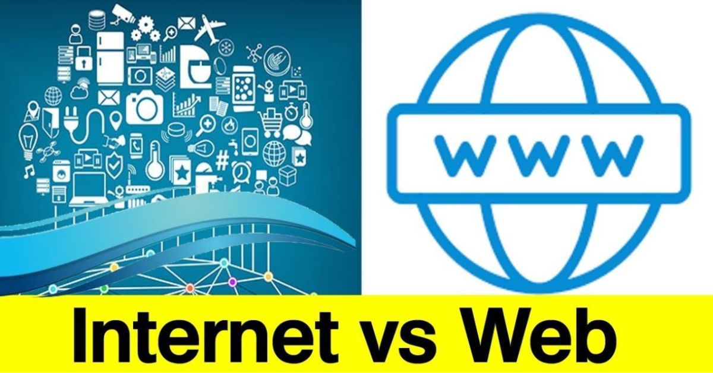

## Internet

**Internet** est un réseau mondial d'ordinateurs interconnectés permettant l’échange de données et la communication entre des millions de dispositifs. Il fonctionne grâce à des protocoles standardisés, comme TCP/IP, et supporte divers services tels que le Web, les emails, la messagerie instantanée et bien plus encore.

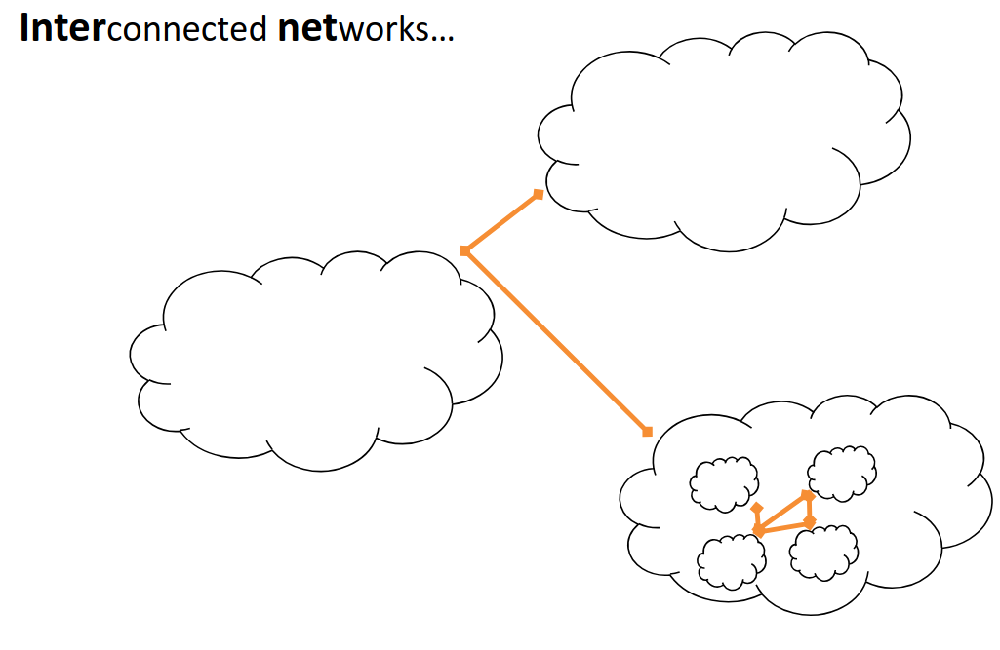

Si internet est un réseau, il faut d'abord comprendre ce qu'est un réseau. **Un réseau** est un ensemble d'appareils connectés entre eux pour échanger des données, partager des ressources (comme des imprimantes ou des serveurs) et communiquer via des protocoles de communication.

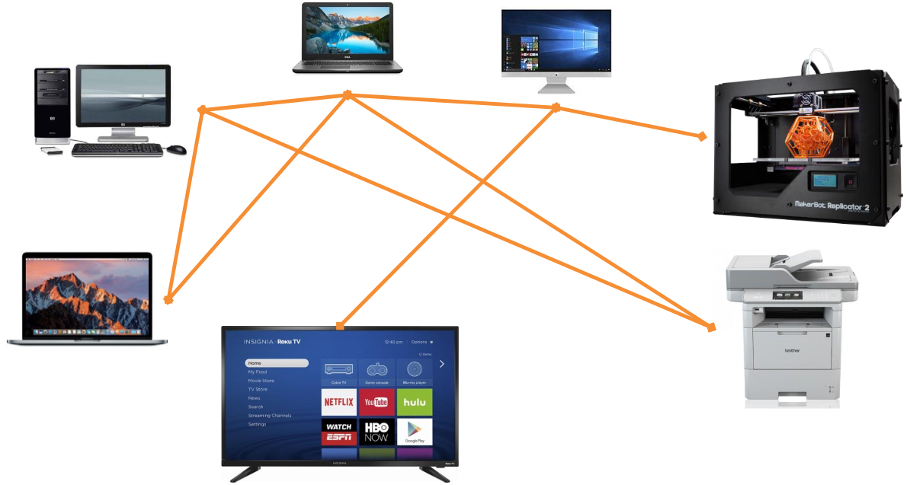

Utilisé de tel réseau permet de nombreux avantage :

1. Partage de ressources (données)

2. Fiabilité (duplication)

3. Adaptabilité (scalabilité)

4. Collaboration

Néanmoins, utilsier un réseau implique de ce mettre d'accord sur un ensemble de règles, de **protocoles**. Ceci reviens à s'accorder sur :

- Le language à utiliser

- Les supports à utilsier

- Le moyen de faire transiter l'information

## Le modèle TCP/IP

Un de ces protocoles est le modèle TCP/IP. Ce protocole est organisé en quatre couches, chacune jouant un rôle spécifique dans la communication des données sur un réseau :

1. **Couche Accès Réseau (ou Couche Liaison)** :
Cette couche concerne la transmission physique des paquets sur les réseaux locaux (LAN) ou étendus (WAN). 

2. **Couche Internet** :
Cette couche gère l’adressage et le routage des paquets de données à travers différents réseaux grâce au protocole IP (Internet Protocol). 
Elle permet de trouver le chemin optimal pour chaque paquet. 

3. **Couche Transport** :
La couche Transport assure la fiabilité des communications entre l’expéditeur et le destinataire. Le protocole TCP (Transmission Control Protocol) garantit la livraison correcte des paquets. 

4. **Couche Application** :
Cette couche fournit des services directs aux utilisateurs et définit les protocoles pour des applications spécifiques (comme HTTP pour le web, SMTP pour les emails, ou FTP pour le transfert de fichiers).
Exemple : Lorsqu'un utilisateur entre une URL, le protocole HTTP est activé pour demander la page web.
 
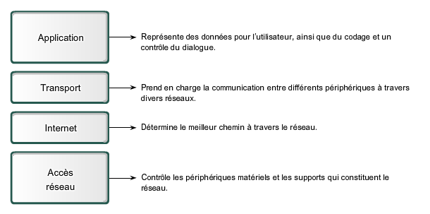

### Couche Accès Réseau
Cette couche gère les protocoles de communication avec le matériel réseau, comme Ethernet ou Wi-Fi. 
C'est dans cette couche, que l'on va s'occuper du type de câble ou d'onde (Wi-Fi, 4G,..), des connecteurs,... La transmission des données sur cette couche ce fait via des bits.

### Couche Internet
C'est ce protocole IP qui gère le transport de paquets de données (datagrammes). 
Chaque machine possède une « adresse IP » qui permet de la localiser sur le réseau. Les datagrammes sont acheminés à destination (adresse IP) grâce à des routeurs qui
décident du chemin à emprunter jusqu’au routeur suivant… et ainsi de suite jusqu’à la destination.

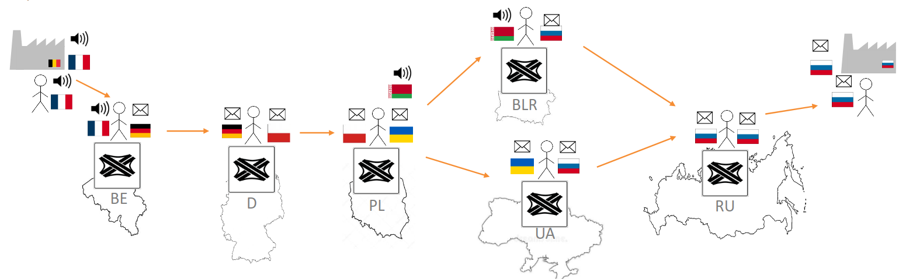

C'est également dans cette couche que l'on va retrouver les **routeurs** (router) et les **commutateur** (switch). 
Un commutateur est un objet qui va peremttre de connecter différents appareils au sein d'un même réseau local (LAN). 
Alors qu'un routeur connecte plusieurs réseaux différents (par exemple votre réseau local à Internet).

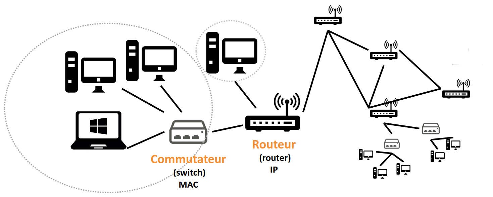

Chaque périphérique possèdent donc une adresse qui l'identifie au réseaux, il y existe deux type d'adresse :

1. **IPv4** : est composée de 32 bits, soit 4 octets, et est généralement écrite sous forme de quatre nombres décimaux séparés par des points (par exemple, 192.168.1.1)

2. **IPv6** : L'adresse IPv6 est composée de 128 bits, soit 16 octets, et est écrite sous forme de huit groupes de quatre chiffres hexadécimaux séparés par des deux-points (par exemple, 2001:0db8:85a3:0000:0000:8a2e:0370:7334)

À l'origine, c'est l'adresse IPv4 qui est apparue en première. Le problème est que celle-ci ne permet qu'un nombre trop restreint d'adresse différente. C'est pourquoi IPv6 a été inventé. 

En plus, de l'adresse IP, on introduit également un **masque de sous-réseau**. 
Un masque de sous-réseau (ou subnet mask) est un outil utilisé pour diviser un réseau IP en sous-réseaux plus petits, ce qui permet une gestion plus efficace de l'adressage IP. 
Il permet de définir quelle partie de l'adresse IP représente le réseau et quelle partie représente l'hôte (le dispositif spécifique dans le réseau).

Par exemple avec l'adresse IP suivante : 91.198.174.2 et le masque de sous-réseau : 255.255.224.0.

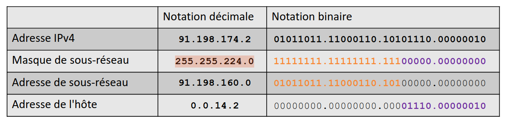

On voit que l'adresse du sous-réseau est 91.198.160.0 et que sur ce sous-réseau l'appareil à son adresse local étant 0.0.14.2.
L'utilisation d'un masque permet d'optimiser la bande passante en limitant les broadcast.

Le protocole IP permet d'assurer la communication, mais il n'offre pas beaucoup de garanties :

- Les données contenues dans le datagramme peuvent être corrompues durant le trajet

- Les datagrammes peuvent arriver dans un ordre différent de celui de l’envoi

- Les datagrammes peuvent être perdus

- Les datagrammes peuvent être dupliqués

Néanmoins, avec ce système les entêtes des datagrammes transmis ne sont pas corrompus.

### Couche transport

Pour pallier au faiblesse de protocole IP, il a fallu introduire de  nouveaux protocoles, dont notamment le protocole **TCP** (Transmission Control Protocol) et le protocole **UD** (User Datagram Protocol).

**Le TCP** (Transmission Control Protocol) est un protocole de communication fiable qui assure l'ordre et la validité des données transmises entre un émetteur et un destinataire. 
Chaque segment TCP inclut un numéro de séquence, permettant de garantir l'ordre des segments dans la transmission, et une somme de contrôle (checksum) qui est ajoutée par l'émetteur pour vérifier l'intégrité des données. 
Le destinataire vérifie cette somme de contrôle pour s'assurer de la validité des données reçues. 
De plus, TCP utilise un mécanisme d'acquittement : chaque segment reçu correctement doit être accompagné d'un acquittement (ACK). 
Si l'émetteur ne reçoit pas cet acquittement dans un délai imparti, il retransmet le segment, garantissant ainsi la fiabilité de la transmission. 
Enfin, un mécanisme de contrôle de flux est intégré à TCP pour éviter la surcharge du récepteur, en régulant la quantité de données envoyées à un moment donné.

**Le UDP** (User Datagram Protocol) fonctionne de manière plus simple et rapide. 
Contrairement à TCP, il ne nécessite pas de connexion préalable pour envoyer des données et ne garantit ni l'ordre ni la livraison des datagrammes. 
Chaque datagramme est envoyé indépendamment, ce qui le rend moins fiable que TCP, mais aussi plus rapide. 
Ce manque de contrôle sur la transmission fait d'UDP un choix privilégié pour les applications où la vitesse prime sur la fiabilité, comme dans le cas des jeux en ligne ou des communications VoIP. 
UDP est particulièrement adapté à la transmission rapide de petites quantités de données, souvent depuis un serveur vers de nombreux clients simultanément.

### Couche d'application 

La couche d'application est la couche la plus haute du modèle TCP/IP. 
Elle est responsable de l'interaction directe avec les utilisateurs ou les applications logicielles pour fournir des services réseau spécifiques. 
Contrairement aux autres couches, qui s'occupent de la transmission et de la gestion des données au niveau des paquets ou des connexions, la couche d'application offre des services qui permettent aux utilisateurs ou aux programmes de communiquer sur un réseau.

Elle englobe une large gamme de protocoles et services permettant de réaliser des tâches telles que la navigation web (HTTP), l'envoi d'emails (SMTP), le transfert de fichiers (FTP), la messagerie instantanée (XMPP), et bien plus encore. 
En d'autres termes, elle permet aux applications de s'appuyer sur les protocoles réseau pour envoyer et recevoir des données via le réseau.

Dans ce contexte, la couche d'application est responsable de :

- L'interface utilisateur pour les programmes qui utilisent le réseau.
- La gestion de la communication réseau au niveau des applications (par exemple, le format des messages, la gestion des erreurs, la synchronisation).
- La conversion des données pour garantir qu'elles sont compréhensibles pour l'utilisateur ou l'application.

## L'URL 

Une URL (Uniform Resource Locator) est une adresse web utilisée pour localiser une ressource sur Internet. 
Elle permet d'identifier de manière unique un fichier, une page ou un service en ligne en spécifiant son protocole (par exemple, HTTP ou HTTPS), son nom de domaine, et parfois un chemin spécifique vers la ressource (comme /page1 ou /images/photo.jpg)

Une URL se structure en plusieurs parties :

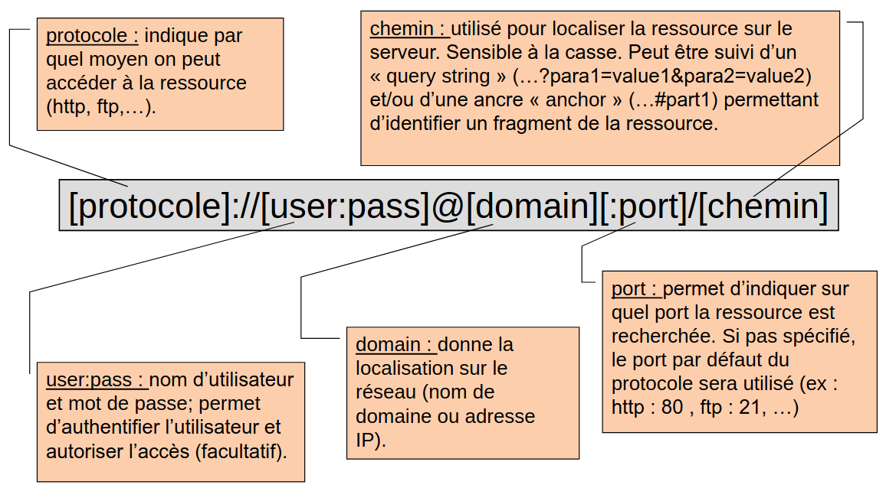

Notons qu'un **domaine** permet de regrouper un ensemble de machines appartenant généralement à une même organisation (ex : helmo.be). 
Le nom de domaine est composé de 2 parties : Top-level domain (TLD) : code du pays (.be, .fr,…) ou un code générique identifiant l’activité (.com,
.net,…) et le Sub-level domain (SLD) : un ou plusieurs labels séparés par un point (helmo, www.helmo, elearning.helmo,…). 
Chaque nom de domaine va être associé à l’adresse IP permettant de localiser la machine sur Internet.

L'URL peut être **aboslu** (c’est l ’adresse complète d’une ressource sur le web; elle est indépendante du contexte), ou **relatif** (c’est une adresse qui est dépendante du contexte (c-à-d de l’URL courante). Le protocole et le domaine ne sont pas spécifiés car déduits de l’URL courante.)

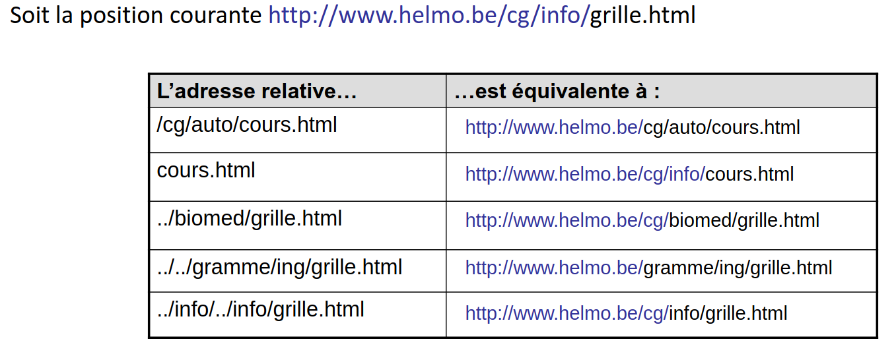

**En résumé, internet c'est un réseau de réseaux exploitant le protocole TCP/IP**

## Le web

Le web, ou de son nom complet **World Wide Web** (WWW) n'est pas la même chose qu'internet.
Il s'agit n système de serveurs permettant d’accéder à des ressources (pages HTML, graphiques, sons, vidéos) reliés entre eux par des liens hypertexte.
Ces pages, écrites en HTML, sont consultables par l'intermédiaire de navigateurs web grâce à des URL. 
Le Web permet aux utilisateurs d'accéder à des informations, de naviguer entre des pages, d'interagir avec des applications en ligne et de partager des contenus multimédias, tout en s'appuyant sur des technologies comme **HTTP/HTTPS**.
On considère que l’inventeur du World Wide Web est Tim Berners-Lee.
Pour accéder à une page web, il faut utiliser un **navigateur** (browser), comme firefox, chrome ou explorer.

Quelques dates clés :

- 1990 : Naissance du World Wide Web

- 1995: Amazon publie son premier site de vente en ligne

- 1998 : Fondation de Google

- 2004: Fondation de Facebook

- 2005 : Fondation de YouTube (la première vidéo: https://www.youtube.com/watch?v=jNQXAC9IVRw)

- 2006: Fondation de Twitter

- …

### Le protocole HTTP :

Le protocole HTTP (Hypertext Transfer Protocol) est un protocole de communication utilisé pour transférer des données sur le Web. 
Il permet la communication entre un client (comme un navigateur web) et un serveur web. 
HTTP définit les règles et formats pour envoyer et recevoir des requêtes et des réponses.

Lorsqu'un utilisateur entre une URL dans son navigateur, ce dernier envoie une requête HTTP au serveur pour demander une ressource (comme une page web, une image ou un fichier). Le serveur répond ensuite avec une réponse HTTP contenant les données demandées, ou un message d'erreur si la ressource n'est pas disponible.
HTTP fonctionne de manière sans état (stateless), c'est-à-dire que chaque requête est indépendante des autres et ne conserve aucune information sur les requêtes précédentes.
Une version plus sécurisée de HTTP est HTTPS (Hypertext Transfer Protocol Secure), qui ajoute une couche de sécurité grâce au cryptage SSL/TLS pour protéger les données échangées entre le client et le serveur.

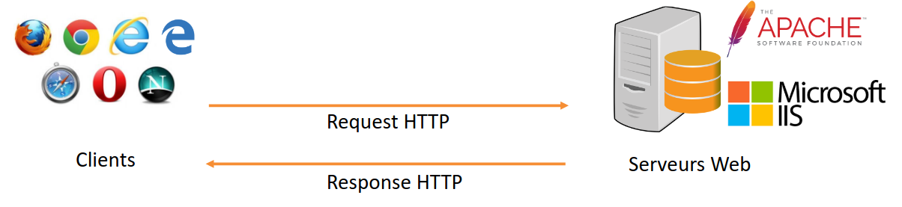

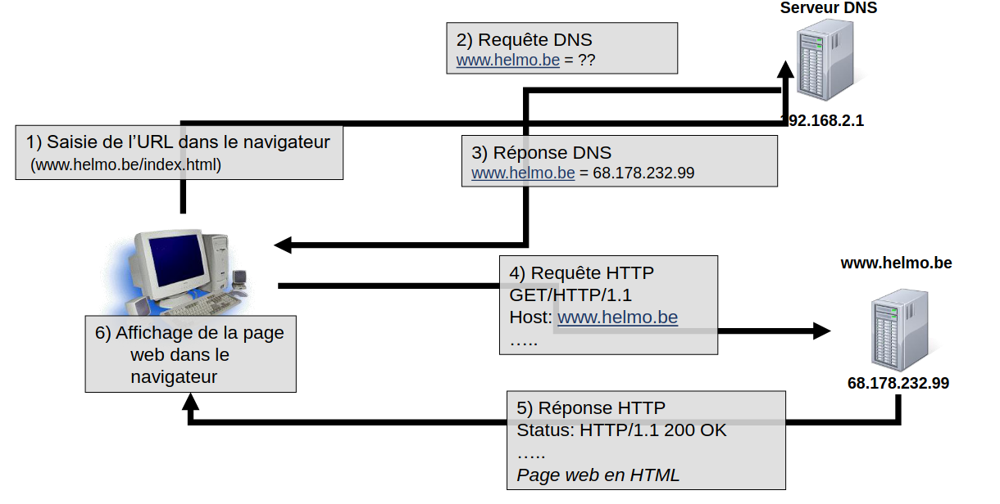

## Danger d'internet

1. Hoax
    - Information fausse ou périmée envoyée par email et relayée spontanément par les internautes.
    -  Pas de danger pour l’ordinateur mais risque de désinformation, d’atteinte à l’image, d’encombrement du réseau ou des organismes mentionnés (ex: accueil d’hôpital)

2. Virus
    - Logiciel malveillant cherchant à se propager à d’autres ordinateurs via un programme hôte.
    - Peut affecter plus ou moins gravement le fonctionnement de l’ordinateur infecté

3. Worm (ver)
    - Logiciel malveillant qui se propage sur plusieurs ordinateurs en utilisant le réseau internet sans nécessiter un programme hôte.
    - Un ver n'a pas besoin d'un programme hôte pour se reproduire. Il exploite les différentes ressources de l'ordinateur qui l'héberge pour assurer sa reproduction.
    - Peut servir de relai pour une attaque de type « Denial of Service » ou provoquer d’autres types de dégâts sur l’ordinateur infecté.

4. Spam (pourriel)
    - Envoi massif de courriers électroniques non-sollicités.
    - Contenu : publicité pour produit pharmaceutiques, liés au sexe, crédit financier, jeux de hasard, produitsde contrefaçon, transfert de fonds…
    - Plus de 90% des emails transitant sur Internet sont des spams.
    - Désagrément pour l’utilisateur, coût de nettoyage des boîtes email, engorgement du réseau…
    - Ne communiquez pas votre adresse email n’importe où ou à n’importe qui…

5. Phishing (hameçonnage)
    - Technique visant à obtenir des renseignements personnels (mot de passe, numéro de carte de crédit,…) en vue de perpétrer une usurpation d’identité.
    - Se fait via l’envoi d’email ou d’un site internet donnant l’impression que l’on s’adresse à un tiers de confiance.

## Quelques choses à savoir...

- Vous n’avez pas (ou peu) de contrôle sur les informations publiées à votre sujet sur Internet.
- L’anonymat n’existe pas sur Internet (votre FAI garde trace de tout ce que vous faites).
- Vos données (adresse IP, O.S., browser, fournisseur d’accès, etc…) ainsi que vos habitudes de surf sont capturées et analysées par certains sites...afin de cibler au mieux la publicité
- Internet propose des contenus dont la qualité et la valeur scientifique n’est pas toujours vérifiée.
- Internet rend accessibles des contenus répréhensibles ou non-adaptés à tous les publics.

