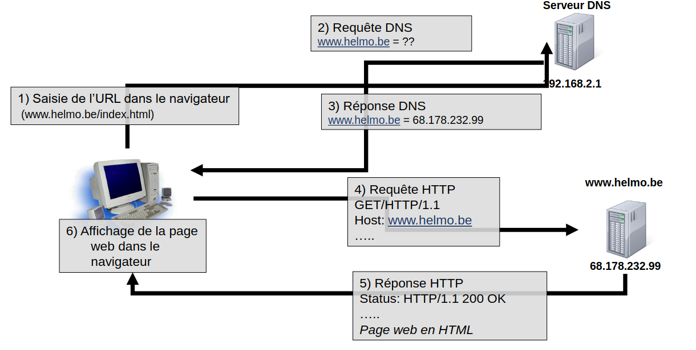

# Le Web

## World Wide Web

Le web, ou de son nom complet **World Wide Web** (WWW) n'est pas la même chose qu'internet.
Il s'agit n système de serveurs permettant d’accéder à des ressources (pages HTML, graphiques, sons, vidéos) reliés entre eux par des liens hypertexte.
Ces pages, écrites en HTML, sont consultables par l'intermédiaire de navigateurs web grâce à des URL. 
Le Web permet aux utilisateurs d'accéder à des informations, de naviguer entre des pages, d'interagir avec des applications en ligne et de partager des contenus multimédias, tout en s'appuyant sur des technologies comme **HTTP/HTTPS**.
On considère que l’inventeur du World Wide Web est Tim Berners-Lee.
Pour accéder à une page web, il faut utiliser un **navigateur** (browser), comme firefox, chrome ou explorer.

Quelques dates clés :

- 1990 : Naissance du World Wide Web

- 1995: Amazon publie son premier site de vente en ligne

- 1998 : Fondation de Google

- 2004: Fondation de Facebook

- 2005 : Fondation de YouTube (la première vidéo: https://www.youtube.com/watch?v=jNQXAC9IVRw)

- 2006: Fondation de Twitter

- …

## Le protocole HTTP :

Le protocole HTTP (Hypertext Transfer Protocol) est un protocole de communication utilisé pour transférer des données sur le Web. 
Il permet la communication entre un client (comme un navigateur web) et un serveur web. 
HTTP définit les règles et formats pour envoyer et recevoir des requêtes et des réponses.

Lorsqu'un utilisateur entre une URL dans son navigateur, ce dernier envoie une requête HTTP au serveur pour demander une ressource (comme une page web, une image ou un fichier). Le serveur répond ensuite avec une réponse HTTP contenant les données demandées, ou un message d'erreur si la ressource n'est pas disponible.
HTTP fonctionne de manière sans état (stateless), c'est-à-dire que chaque requête est indépendante des autres et ne conserve aucune information sur les requêtes précédentes.
Une version plus sécurisée de HTTP est HTTPS (Hypertext Transfer Protocol Secure), qui ajoute une couche de sécurité grâce au cryptage SSL/TLS pour protéger les données échangées entre le client et le serveur.

