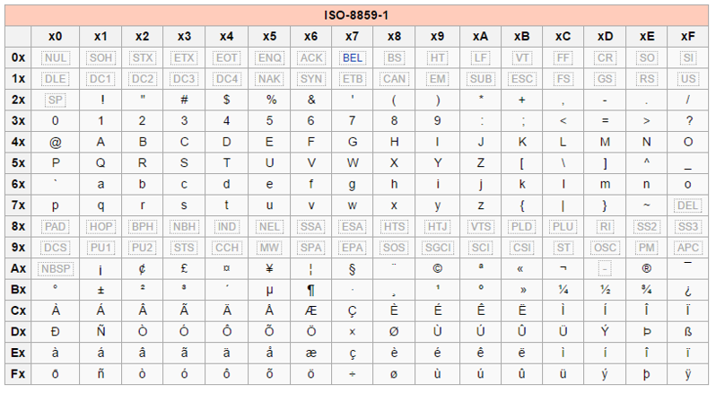

#  Codage  

## Codage des caractères 
### Le codage des caractères en ASCII

En informatique, toute information (texte, son, image, donnée chiffrée) doit pouvoir être représentée comme une suite de bits (bit: valeur soit 1 ou 0) pour pouvoir être traitée par les composants électroniques. Pour une valeur numérique décimale (base 10), sa représentation en bits est sa conversion en binaire (base 2). Pour numériser un texte, chaque caractère est associé arbitrairement à une représentation chiffrée grâce à une table de conversion.
cd
Dans les années 1960, l'ANSI (American National Standards Institute) a publié une normalisation des tables des caractères : la table ASCII (American Standard Code for Information Interchange). Chaque caractère est codé sur 7bits et donc contient 2^7 = 128 caractères différents. Si cette table convient pour numériser des textes écrits en anglais, elle est trop limitée pour des textes écrits en français, en espagnol, etc.

Les 33 premiers caractères sont des caractères de contrôle. (Exemple: le caractère "barre d'espace" est représenté par la valeur 32 en décimal).

!!! Tip " Taper un caractère grâce au code ASCII "

    **Astuce**  : En maintenant appuyée la touche "Alt" suivi du code décimal ASCII, il est possible d'écrire le caractère. C'est parfois utile lorsqu'un clavier ne propose pas de touche pour certains caractères spéciaux ou que la touche est défectueuse.

    Ouvrez Microsoft Word ou NotePad++, maintenez la touche "Alt" et tapez 60, relâchez "Alt" et recommencez pour taper "Alt+58" puis "Alt+41". Qu'obtenez-vous ?

    Supposez que la touche "{" ne fonctionne plus, quel code ASCII devez-vous utiliser ?

	??? note "Réponses"
        "Alt+123"

### Le codage des caractères en ISO8859-1

Avec la diffusion de l'informatique dans les pays non anglophones, la nécessité de pouvoir utiliser plus de caractères spéciaux (notamment accentués) s'est imposée.

Des extensions de la table ASCII ont émergé en utilisant 1bit supplémentaire par caractère (8bits => 2^8 = 256 caractères). Les 128 nouveaux caractères varient d'une table de conversion à l'autre pour s'adapter à différentes langues ou groupes de langues.

Pour éviter des erreurs d'interprétation, le lecteur d'un texte doit utiliser la même version régionalisée de la table de caractères.

L'IANA (Internet Assigned Numbers Authority) a validé, pour une utilisation sur Internet, le codage ISO-8859-1 ou Latin1 permettant d'encoder les langues issues d'Europe occidentale.

### Le codage des caractères en Unicode

La difficulté de maintenir une grande variété de tables de caractères ainsi que l'impossibilité de pouvoir représenter d'autres "caractères" issus de langues non européennes (chinois, arabe, japonais, russe, ...) ont poussé les plus grands acteurs du monde informatique à se rassembler en consortium pour créer une table de caractères universelle : l'Unicode.

Chaque caractère peut être codé sur 4 octets ( 4\* 8 bits, 2^32 = +4 milliards de caractères). Les caractères ASCII occupent toujours les 128 premières valeurs.

!!! Tip " Des sinogrammes "
  
    Editez votre fichier test.html pour faire apparaître 5 sinogrammes (symboles chinois) de votre choix. Pour cela, consultez la [table de caractère Unicode](http://unicode-table.com/fr) afin de trouver la représentation de sinogrammes.

### Différentes versions d'Unicode

Plusieurs versions d'encodage existent:

*   UTF-8 : 1 octet pour les caractères ASCII, et de 2 à 4 octets pour les autres caractères,
*   UTF-16 : 2 ou 4 octets par caractère,
*   UTF-32 : toujours 4 octets par caractère.

En UTF-32, le décodage (passage de la valeur numérique au caractère) est très rapide puisqu'il suffit de couper uniformément la séquence de bits tous les 32bits ( = 4 octets). Par contre, la plupart des textes, ne contenant pas ou peu de caractères spéciaux, occuperont de l'ordre de 4 fois plus d'espace mémoire qu'en UTF-8. En UTF-8, l'occupation mémoire est minimisée mais le décodage prend plus de temps puisqu'il faut déterminer pour chaque caractère s'il occupe 1, 2 ou 4 octets. La version UTF-16 est un compromis entre espace mémoire nécessaire et temps de décodage.

Dans le contexte du développement web, la version UTF-8 est actuellement la plus recommandée !

#### UTF-8 avec ou sans BOM ?

Le caractère BOM (Byte Order Mark) est un caractère invisible placé comme premier caractère d'un fichier encodé en UTF-8. En développement web, ce caractère est envoyé en sortie (affichage par le navigateur) avant l'interprétation des lignes de code. Or notamment en PHP, certaines fonctions doivent absolument être appelées AVANT tout envoi de caractère en sortie.

Veuillez vous assurer que vos fichiers sont encodés en UTF-8 sans BOM !!

#### Cohérence de l'environnement de développement web

Pour éviter tout problème de codage de caractère, il faut que tous les intervenants utilisent l'UTF-8 ! :

*   L'éditeur (UTF-8 sans BOM)
*   La base de données
*   Le navigateur via la balise <meta charset="">

#### Différence entre encodage et conversion de caractères

<iframe width="560" height="315" src="https://www.youtube.com/embed/DrFBYzczHn4?si=34MxoldXsjtf9lSw" title="Codage vs Encodage des caractères" frameborder="0" allow="accelerometer; autoplay; clipboard-write; encrypted-media; gyroscope; picture-in-picture; web-share" referrerpolicy="strict-origin-when-cross-origin" allowfullscreen></iframe>
<small>(Vidéo: "Codage vs Encodage des caractères", durée: 3min36)</small>

