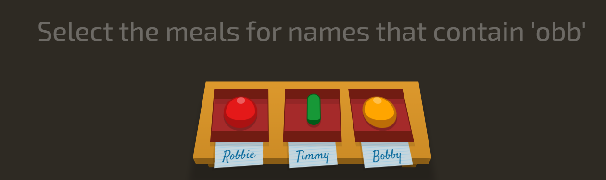
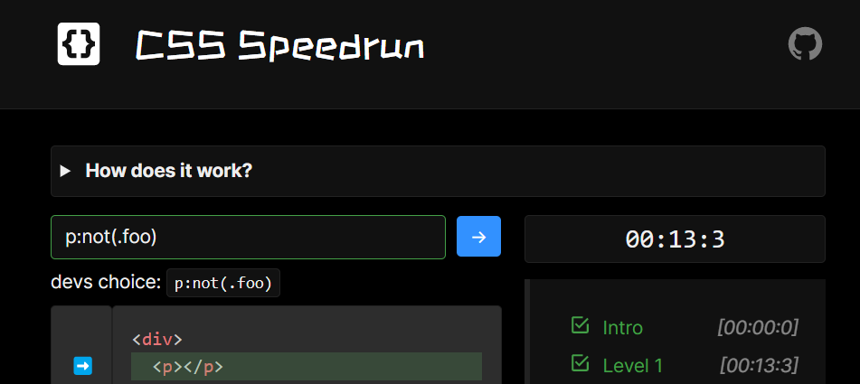

#  S'entrainer

*"Le codage, c'est comme un entraînement : il faut persévérer, même quand les bugs te donnent envie de tout balancer !"*

Fluke Out est un site web interactif qui permet d'apprendre et de pratiquer les sélecteurs CSS de manière ludique. Le jeu propose des défis où les utilisateurs doivent sélectionner des éléments HTML spécifiques en utilisant les sélecteurs CSS appropriés. C'est un excellent outil pour améliorer ses compétences en CSS tout en s'amusant. Les défis varient en difficulté, ce qui permet de s'adapter à différents niveaux d'expérience.

Les éléments présentés ne sont pas des balises HTML réelles, mais plutôt des représentations visuelles qui simulent une structure DOM. Cela permet aux utilisateurs de se concentrer sur l'utilisation des sélecteurs CSS sans se soucier de la syntaxe HTML.

{:target="_blank"}

Le site suivant utilise des sélecteurs avancés.

Speedrun est une plateforme ludique dédiée à l'apprentissage des sélecteurs CSS, où les utilisateurs peuvent relever des défis de codage dans un format de jeu. En relevant des défis à différents niveaux, les utilisateurs "courent" pour atteindre des objectifs tout en recevant des retours instantanés sur leur code. Avec une interface engageante et un classement compétitif, Speedrun rend le codage fun et addictif, tout en boostant vos compétences en CSS !

{:target="_blank"}