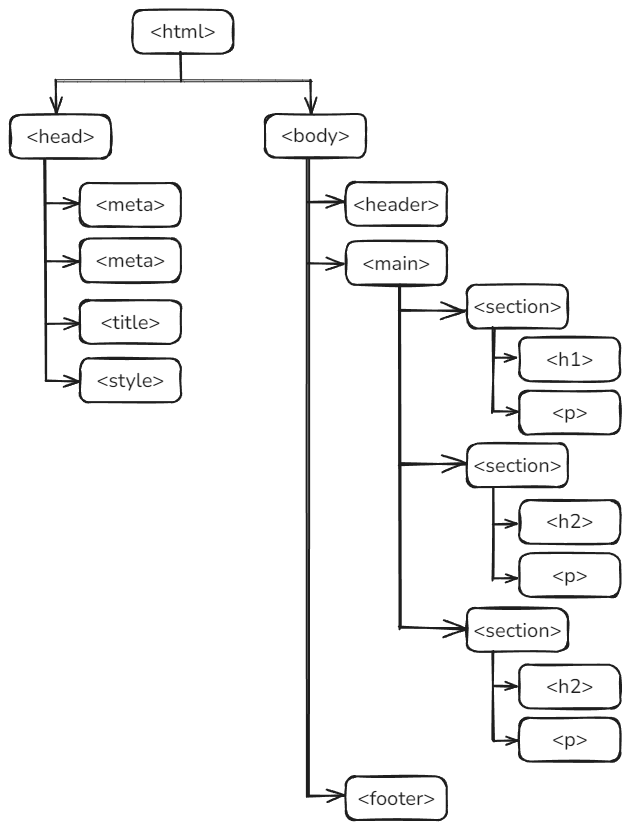

##Découverte #1

C'est parti pour votre première feuille de style.

>:warning: Durant ce premier exercice, pour une question de facilité,  nous allons utiliser des techniques qui seront et devront être optimisées par la suite.

??? quote "Exercice"
    * Créez un nouveau fichier nommé `css-cameleon.html` ([>> veiller à lui attribuer un emplacement et un nom cohérents ](../html_init/organisation.md){:target="_blank"})
    * Copiez ce texte dans le fichier
    ```html
    <!DOCTYPE html>
    <html lang="fr">
    <head>
        <meta charset="UTF-8">
        <meta name="viewport" content="width=device-width, initial-scale=1.0">
        <title>Testing</title>
    </head>
    <body>
        <header>
            <em>Ici le <strong>header</strong> de la page</em>
        </header>
        <main>
            <section>
                <h1>Offres à la une</h1>
                <p>Lorem ipsum dolor sit amet consectetur, adipisicing elit. Dicta dignissimos hic in, distinctio deleniti corporis esse mollitia odit ratione doloremque architecto perferendis explicabo veritatis nesciunt assumenda voluptatum consequatur aspernatur libero?</p>
            </section>
            <section>
                <h2>Nos agences</h2>
                <p>Lorem ipsum dolor sit amet consectetur, adipisicing elit. Dicta dignissimos hic in, distinctio deleniti corporis esse mollitia odit ratione doloremque architecto perferendis explicabo veritatis nesciunt assumenda voluptatum consequatur aspernatur libero?</p>
            </section>
            <section>
                <h2>Nos circuits</h2>
                <p>Lorem ipsum dolor sit amet consectetur, adipisicing elit. Dicta dignissimos hic in, distinctio deleniti corporis esse mollitia odit ratione doloremque architecto perferendis explicabo veritatis nesciunt assumenda voluptatum consequatur aspernatur libero?</p>
            </section>
        </main>
        <footer>
            Copyright HELMo 2024
        </footer>
    </body>
    </html>
    ```

Observez le rendu dans un navigateur.  Nous pouvons constater que les titres sont en gras, et de taille plus importante que les paragraphes.  La balise `<em>` provoque un rendu italique et la balise `<strong>` provoque du gras.

Nous pouvons donc en déduire que les balises ont des styles par défaut.

### Styles par défaut

Le style par défaut d'une balise HTML représente l'apparence appliquée par le navigateur en l'absence de tout style CSS personnalisé. Ces styles sont définis par les navigateurs eux-mêmes et varient légèrement selon chaque navigateur. Ils incluent des propriétés comme les marges, les paddings, la taille des polices...  Les styles par défaut sont appelés ***user-agent stylesheets***.

Pour voir les styles par défaut, on peut utiliser les outils de développement du navigateur ([inspecter l'élément](inspecteur.md)) et observer les styles applicables par défaut sous "user-agent stylesheet". 

##Découverte #2

Ajoutez le code suivant (surligné en bleu) dans votre fichier html

```html  hl_lines="6-11" linenums="1" 
[code précédent]
<head>
    <meta charset="UTF-8">
    <meta name="viewport" content="width=device-width, initial-scale=1.0">
    <title>Testing</title>
	<style>
	    body {
			background-color: Lavender;
            color : Purple;
		}
	  </style>
</head>
[code suivant]
```
Rafraichissez l'affichage du fichier "css-cameleon.html" dans votre navigateur. Vous pouvez constater que vous avez modifié le visuel de la page sans avoir modifié le code HTML.

Que constatez-vous ? 
Tous les éléments obtiennent un fond "lavende" et une couleur de texte "Prune".

Modifiez maintenant ce code :

```html  hl_lines="10-14" linenums="1" 
[code précédent]
<head>
    <meta charset="UTF-8">
    <meta name="viewport" content="width=device-width, initial-scale=1.0">
    <title>Testing</title>
	<style>
	    body {
			background-color: Lavender;
            color : Purple;
		}
		h1{
			color: DarkGreen;
			font-size : 3rem;
		}
	  </style>
</head>
[code suivant]
```

Que constatez-vous ? 
Tous les éléments gardent le fond "lavende"  et une couleur de texte "prune", excepté le titre de niveau 1 qui devient de couleur verte et de taille plus grande.  Le titre de niveau 1 hérite de la couleur de fond de son parent.

Modifiez maintenant ce code :

```html  hl_lines="15-17" linenums="1" 
[code précédent]
<head>
    <meta charset="UTF-8">
    <meta name="viewport" content="width=device-width, initial-scale=1.0">
    <title>Testing</title>
	<style>
	    body {
			background-color: Lavender;
            color : Purple;
		}
		h1{
			color: DarkGreen;
			font-size : 3rem;
		}
        section {
			background-color: white;
		}
	  </style>
</head>
[code suivant]
```

Que constatez-vous ? 
Le fond des sections devient blanc mais le texte garde la couleur "prune".

###Héritage : Les concepts de balises "parent" et "enfant"

Les règles de styles CSS s'appliquent en **cascade** d'une balise conteneur (parent) aux balises contenues (enfants) selon le modèle **parent-enfant**.

Dans notre exercice, nous avons cette structure :



On constate donc clairement que tous les enfants et petits-enfants du body héritent des styles du parent.
Par contre, la couleur de fond des  `<section>`, bien qu'héritant elle aussi de la couleur "lavende" de `<body>`, est remplacée explicitement par du blanc.

>:warning: toutes les propriétés ne sont pas héritées automatiquement. Certaines balises n'héritent pas de certaines propriétés de leur parent par défaut pour des raisons de logique ou de comportement. Nous y reviendrons par la suite.

>:warning: il est important d'éviter la **redondance des styles** en les définissant le plus haut possible dans l'arborescence des balises HTML.

Comparez ces deux codes :
 

!!! Failure  inline ":fontawesome-regular-rectangle-xmark:{.redWhite } Don't do this "
    ```html  
    body {
			background-color: Lavender;
			color : Purple;		 
	}
	h1{
			background-color: Lavender;
            color: DarkGreen;
			font-size : 3rem;
	}
	section {
			background-color: white;
            color : Purple;
	}
	section h1 {
			background-color: white;
            color : Purple;
	}
	section p {
			background-color: white;
            color : Purple;
	}
    ``` 

!!! Success inline ":white_check_mark: Do this "
    ```html  
    body {
			background-color: Lavender;
			color : Purple;		 
	}
	h1{
			color: DarkGreen;
			font-size : 3rem;
	}
	section {
			background-color: white;
	}
    ```

<div class="clearFloat"></div> 
