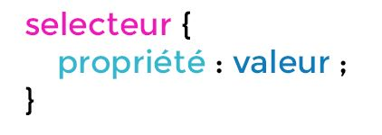

Les sélecteurs sont utilisés pour cibler les éléments HTML sur lesquels des styles doivent s'appliquer.



|Terme|Explication|
|--|--|
|`selecteur` |détermine sur quel élément sera appliqué l'ensemble des propriétés|
|`propriété` |détermine la propriété à appliquer|
|`valeur` |valeur à appliquer pour la propriété|
|`propriété : valeur` |détermine le style à appliquer|

Pour découvrir les sélecteurs, nous allons utiliser cet exercice.

REM : cette liste de sélecteurs n'est pas exhaustive.

Méthode :

* Créez un nouveau fichier nommé testing.html ([>> veiller à lui attribuer un emplacement et un nom cohérents ](../html_init/organisation.md))
* Créez un dossier nommé `css` et dans ce dossier, créer un fichier nommé `testing.css`.
* Copiez ce code dans le fichier `testing.html `
* Tous les exemples suivants sont à appliquer dans cet exercice.

??? quote "Code à copier"
    ```html
    <!DOCTYPE html>
    <html lang="fr">
    <head>
        <meta charset="UTF-8">
        <meta name="viewport" content="width=device-width, initial-scale=1.0">
        <title>Testing</title>
    </head>
    <body>
        <header>
        Fornite 
        <nav>
            <ul>
                <li>Boutique</li>
                <li>Passe de combat</li>
                <li>Actus</li>
            </ul>
        </nav>
        </header>
        <main>
            <section>
                <h1>Fortnite : Cauchemars s'abat sur la mise à jour 31.40 de Battle Royale</h1>
                <p>Envie de jouer à un petit jeu ? Que diriez-vous d'une partie de Battle Royale... pendant <strong>Fortnite : Cauchemars 2024</strong> ? Cette année, les festivités comprennent le <strong>Billy explosif</strong>, une tronçonneuse mobile, le retour du mode Assaut de la horde et des tas de récompenses de quête, comme par exemple la traînée <strong>Citrouille planante</strong> et le planeur <strong>Grand épouvantail</strong>. Fortnite : Cauchemars 2024 se déroule jusqu'à la fin du Chapitre 5 - Saison 4 !</p>
            </section>
            <section>
                <h2>Ça va tronçonner</h2>
                <p>Assez joué comme ça. Utilisez la <strong>tronçonneuse </strong> pour trancher vos adversaires... ou plantez-la dans le sol pour vous propulser en avant à toute vitesse ! De quoi enchaîner les victoires !</p>
                <p>Vous pouvez trouver les tronçonneuses sur le sol et dans les coffres. Ça va trancher !</p>
                <h2>Terreur en tricycle</h2>
                <p>Si vous voyez un tricycle derrière vous, fuyez ! Les joueurs peuvent désormais lancer un <strong>Billy explosif</strong>, un petit pantin qui traque l'adversaire le plus proche... et cela peut tout à fait être vous.</p>
                <p>Il s'approche de vous en tricycle, puis explose à l'impact. Échappez-vous avant sa détonation, ou vous serez sa nouvelle victime !</p>
                <h2>Plongez vos crocs dans les récompenses de quête</h2>
                <ul>
                    <li>Accomplir 1 quête : la basse <strong>Chauve-souris démoniaque</strong></li>
                    <li>Accomplir 2 quêtes : l'émoticône <strong>Heaume du Sculpteur</strong></li>
                    <li>Accomplir 3 quêtes : l'accessoire de dos <strong>Pneu guerrier de la horde</strong></li>
                    <li>Accomplir 4 quêtes : l'écran de chargement <strong>Angoisse et chair de poule</strong></li>
                </ul>
            </section>
        </main>
        <footer>
            Copyright Epic Games 2024
        </footer>
    </body>
    </html>
     
    ```


Différents types de sélecteurs existent.

##Sélecteur de type<a name="selecteurType"></a> 

Permet d'appliquer un style à une balise pour styler toutes les occurrences de cette balise.
```css
strong{
    color: orange;
}
```

Le sélecteur de balise cible tous les éléments d’un type spécifique.  Dans l'exemple donné, tous les textes de toutes les balises `<br>` seront de couleur orange. Il n’est pas très précis car il applique le même style à tous les éléments de ce type sur la page, sans distinction. Pour des styles plus ciblés, on utilise des sélecteurs de classe ou d’identifiant.

##Sélecteur de class<a name="selecteurClass"></a>

Le sélecteur de type `class` permet de définir un style qui sera appliqué à toutes les balises html utilisant cette `class`.

Le sélecteur de classe commence toujours par un point `.`  suivi d'un `nom de votre choix`.

```css title="CSS"
.final-summary{
    background-color: DarkRed;
    color: white;
}
```
Les balises html sur lesquelles nous vous appliquer le style utilisera l'attribut `class` et le `nom de la class` comme valeur d'attribut.
```html title="HTML"
<section>
    <h2>Ça va tronçonner</h2>
    <p>Assez joué comme ça. Utilisez la <strong>tronçonneuse </strong> pour trancher vos adversaires... ou plantez-la dans le sol pour vous propulser en avant à toute vitesse ! De quoi enchaîner les victoires !</p>
    <p class="final-summary">Vous pouvez trouver les tronçonneuses sur le sol et dans les coffres. Ça va trancher !</p>
    <h2>Terreur en tricycle</h2>
    <p>Si vous voyez un tricycle derrière vous, fuyez ! Les joueurs peuvent désormais lancer un <strong>Billy explosif</strong>, un petit pantin qui traque l'adversaire le plus proche... et cela peut tout à fait être vous.</p>
    <p class="final-summary">Il s'approche de vous en tricycle, puis explose à l'impact. Échappez-vous avant sa détonation, ou vous serez sa nouvelle victime !</p>
    <h2>Plongez vos crocs dans les récompenses de quête</h2>
    <ul>
        <li>Accomplir 1 quête : la basse <strong>Chauve-souris démoniaque</strong></li>
        <li>Accomplir 2 quêtes : l'émoticône <strong>Heaume du Sculpteur</strong></li>
        <li>Accomplir 3 quêtes : l'accessoire de dos <strong>Pneu guerrier de la horde</strong></li>
        <li>Accomplir 4 quêtes : l'écran de chargement <strong>Angoisse et chair de poule</strong></li>
    </ul>
</section>
```
##Sélecteur d'identifiant <a name="selecteurId"></a>

Le sélecteur de type `id` permet de définir un style qui sera appliqué à la balise html utilisant cet `id`.

Le sélecteur d'identifiant commence toujours par un point `#`  suivi d'un `nom de votre choix`.

```css title="CSS"
#nav-principal{
    background-color: black;
    color: white;
}
``` 

La balise  html sur laquelle nous vous appliquer le style utilisera l'attribut `id` et le `nom de l'identifant` comme valeur d'attribut.
```html title="HTML"
<nav id="nav-principal">
    <ul>
        <li>Boutique</li>
        <li>Passe de combat</li>
        <li>Actus</li>
    </ul>
</nav>
```

!!! Tip 
    Le nom d'un #id ne doit pas contenir :

        - des espaces,
        - des caractères spéciaux,
        - des accents.

    Il doit commencer par une lettre (non pas un chiffre).


!!! Tip 
    IMPORTANT : Un style appliqué à un id est prioritaire au style appliqué à une classe.
    IMPORTANT : vous pouvez appliquer une class autant de fois que vous le désirez dans un document html. Par contre, vous ne pouvez utiliser qu'une seule fois un identifiant sur une page html.
    ```html  title="html incorrect"
        <section id="monId">
            ici le texte de la section 
        <section>
        <section id="monId">
            ici le texte de la section 
        <section>
        <section id="monId">
            ici le texte de la section 
        <section>
    
    ```
    ```html  title="html correct"
        <section class="maClass">
            ici le texte de la section 
        <section>
        <section class="maClass">
            ici le texte de la section 
        <section>
        <section class="maClass">
            <p id="monId">ici le texte de la section </p>
        <section>
    
    ```

##Liste de sélecteurs<a name="selecteurListe"></a>
Cibler toutes les occurences de plusieurs balises

```css  title="CSS"
h1, h2{
    border-bottom : 1px solid DarkRed;
}
```
Tous les titres `h1` ET  (,)  `h2` auront une bordure basse.

##Sélecteurs descendants <a name="selecteurDesc"></a>

Cibler toutes les occurrences d'une balise contenues dans une balise spécifique.

```css  title="CSS"
#nav-principal li {
   list-style-type: "\1F44D";
}
```
Tous les `li` contenu dans la balise possédant l'identifiant `nav-principal` auront une puce modifiée.
Regardez votre fichier, la seconde liste n'a pas ses puces modifiées.

##Sélecteurs balise html <a name="selecteurBalise"></a>

Un élément html peut posséder plusieurs valeurs pour l'attribut class, ce qui permet d'appliquer plusieurs styles CSS à un même élément. 

**Syntaxe** : Les valeurs de classe sont séparées par des espaces.  
**Cascading** : Les styles s'appliquent en fonction de l'ordre de définition dans le CSS. Si deux classes définissent des styles conflictuels, le style de la dernière classe spécifiée dans le CSS prendra effet. 

**Utilité** :  

- *Réutilisation des styles*  :  Permet de combiner des styles de différentes classes pour un seul élément, facilitant ainsi la gestion et la réutilisation du code CSS.  
    
- *Modularité*   : En utilisant plusieurs classes, les développeurs peuvent appliquer des styles spécifiques tout en maintenant une structure modulaire. Cela améliore la clarté et la maintenabilité du code.

```css
<h1 class="classe1 classe2 classe3">Contenu</h1>
```