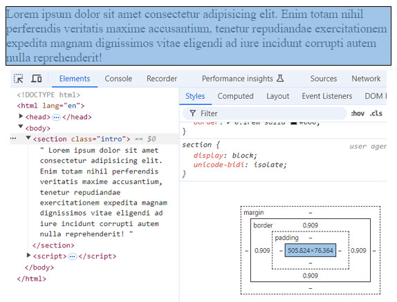
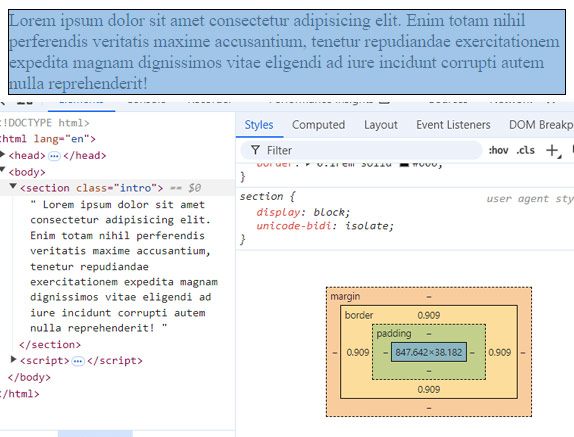
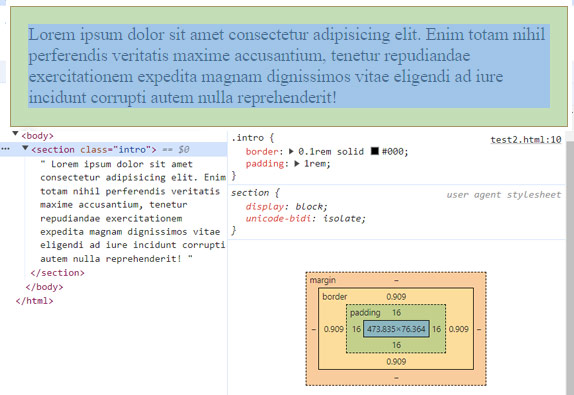
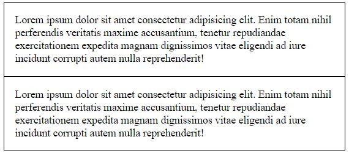
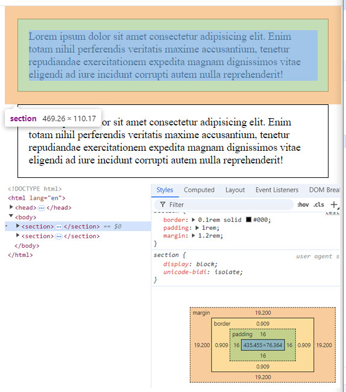
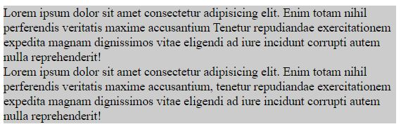
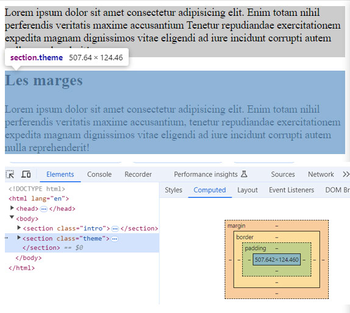
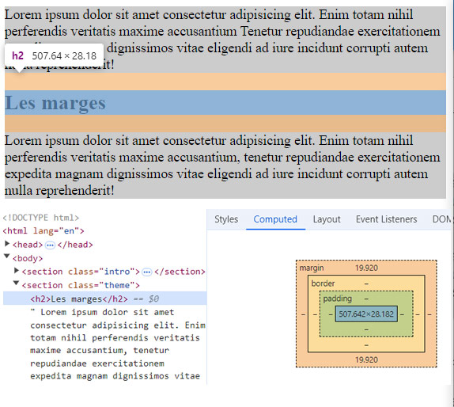

#Modèle de la boite

##Intro
Chaque élément HTML est interprété par le navigateur comme une "boîte".  Découvrons les caracteristiques de cette boite.

Note : les captures d'écran de l'inspecteur ont été réalisées sous Chrome.  En fonction de votre navigateur, il se peut que les informations et couleurs soit présentées différemment.

Préparez votre environnement de découverte :

* Créez un nouveau dossier
* Créez un nouveau fichier nommé `boiteTest.html` et copiez le code suivant 

??? quote "Code à copier"
    ```html 
    <!DOCTYPE html>
    <html lang="en">

    <head>
        <meta charset="UTF-8">
        <meta name="viewport" content="width=device-width, initial-scale=1.0">
        <title>Modèle de boite : testing</title>
        <style>
            /*pour une question de facilité, nous utiliserons les styles directement dans la page. Mais n'oubliez pas que dans tout projet, il faut utiliser une feuille de style externe.*/
            section{
                border: 0.1rem solid #000;
            }
        </style>
    </head>

    <body>
        <section>
            Lorem ipsum dolor sit amet consectetur adipisicing elit. Enim totam nihil perferendis veritatis maxime
            accusantium, tenetur repudiandae exercitationem expedita magnam dignissimos vitae eligendi ad iure incidunt
            corrupti autem nulla reprehenderit!
        </section>
    </body>

    </html>
    ``` 

##Contenu

A l'aide de l'inspecteur, observez le modèle de boite.

 

Le contenu de l'élément est en bleu.

Les propriétés `height` et `width` permettent de définir la hauteur et la largeur du contenu. Rem :  Nous verrons plus tard qu'il ne s'agit pas de la place occupée par l'élément dans le flux courant.


##Padding

Toujours à l'aide de l'inspecteur, observez le modèle de boite,  le padding (en vert) et le margin (en orange).



Nous observons qu'il n'y a pas de valeurs pour les margin et padding.  Le contenu est collé au bord de la boite, matérialisé par la bordure.

Modifions le code : 

```html  hl_lines="4" linenums="1" title="css : padding"
[...code précédent...]
section {
    border: 0.1rem solid #000;
    padding: 1rem;
}
[...code suivant...]
```
Le contenu est maintenant espacé du bord de la boite de l'élément.

Inspectez votre code.



Visuellement, nous retrouvons l'espace *en vert*.

**Nous pouvons donc dire que la propriété padding est l'espace vide placé entre le contenu et le bord de l'élément. On pourrait également appeler la propriété padding "marge intérieure de la boite".**  

##Margin

Modifions le code et ajoutons une autre section :

```html  hl_lines="2-4" linenums="1" title="css : margin"
[...code précédent...]
<section>
    Lorem ipsum dolor sit amet consectetur adipisicing elit. Enim totam nihil perferendis veritatis maxime accusantium, tenetur repudiandae exercitationem expedita magnam dignissimos vitae eligendi ad iure incidunt corrupti autem nulla reprehenderit!
</section>
[...code suivant...]
```


Visuellement, les deux sections se touchent.  Pour les espacer, nous allons utiliser un `margin`.

```html  hl_lines="5" linenums="1" title="css : margin"
[...code précédent...]
section {
    border: 0.1rem solid #000;
    padding: 1rem;
    margin : 1.2rem;
}
[...code suivant...]
```

Inspectez votre code et observez les marges.



Visuellement, nous retrouvons l'espace *en orange*.

**Nous pouvons donc dire que la propriété margin est l'espace vide placé entre le bord de l'élément et les autres éléments. On pourrait également appeler la propriété padding "marge extérieure de la boite".**  

##Valeur par défaut

**Selon le type d'élément, les éléments HTML ont par défaut des valeurs pour les marges et le padding.** Par exemple, les titres (`<h1>`, `<h2>`, etc.), les listes (`<ul>`), les paragraphes (`<p>`)... ont des marges automatiques définies par le navigateur.

Modifiez le code comme suit et observez les différentes valeurs par défaut avec l'inspecteur.

TIPS : cliquez sur la balise html pour voir le code css appliqué et les valeurs par défaut.

```html   linenums="1" 
<section class="intro">
    <p>Lorem ipsum dolor sit amet consectetur adipisicing elit. Enim totam nihil perferendis veritatis maxime accusantium</p>
    <p>Tenetur repudiandae exercitationem expedita magnam dignissimos vitae eligendi ad iure incidunt
    corrupti autem nulla reprehenderit!</p>
</section>
<section class="theme">
    <h2>Les marges</h2>
    <p>Lorem ipsum dolor sit amet consectetur adipisicing elit. Enim totam nihil perferendis veritatis maxime  accusantium, tenetur repudiandae exercitationem expedita magnam dignissimos vitae eligendi ad iure incidunt corrupti autem nulla reprehenderit!
</section>
```

Ces valeurs par défaut peuvent être modifiées via le CSS en spécifiant explicitement les propriétés margin et padding. Cela permet de contrôler précisément l'espacement interne (padding) et externe (margin) de chaque élément.

##La fusion des marges

Toujours en partant du code précédent.
Vous avez défini une marge de 1.2rem pour chaque section. Logiquement, on pourrait s'attendre à ce que l'espace entre deux sections adjacentes soit la somme de ces deux marges, soit 2.4rem (1.2rem + 1.2rem). Cependant, en inspectant la page avec les outils de développement, on constate que l'espace réel entre les sections est seulement de 1.2rem.

**Pourquoi l'espace entre les sections n'est-il pas de 2.4rem ?**

Utilisez l'inspecteur pour observer le comportement des marges.
Modifiez le code css comme suit et attribuez la class `intro` à la première section et la class `theme` à la seconde section:

```css    title="margin"
<style>
        /*pour une question de facilité, nous utiliserons les styles directement dans la page. Mais n'oubliez pas que dans tout projet, il faut utiliser une feuille de style externe.*/
        section {
            border: 0.1rem solid #000;
            padding: 1rem;
        }

        .intro {
            margin: 1.2rem;
        }

        .theme {
            margin: 4rem;
        }
</style>
```
Que pouvez-vous en déduire ? 

L'espace entre les deux sections est de 4rem au lieu de 5.2rem (1.2rem + 4rem) en raison du phénomène appelé "fusion de marges" (collapsing margins). **Lorsque deux éléments blocs verticaux ont des marges adjacentes, la marge la plus grande est appliquée, et non la somme des deux. 
Attention, la fusion des marges concerne uniquement les marges verticales.**

##Débordement

Remplacez votre code par celui-ci : 
??? quote "Nouveau code"
    ```html   linenums="1" title="margin"
    <!DOCTYPE html>
    <html lang="en">

    <head>
        <meta charset="UTF-8">
        <meta name="viewport" content="width=device-width, initial-scale=1.0">
        <title>Modèle de boite : testing</title>
        <style>
            /*pour une question de facilité, nous utiliserons les styles directement dans la page. Mais n'oubliez pas que dans tout projet, il faut utiliser une feuille de style externe.*/
            section {
                background-color: #CCC;
            }

            .intro {}

            .theme {}
        </style>
    </head>

    <body>
        <section class="intro">
            Lorem ipsum dolor sit amet consectetur adipisicing elit. Enim totam nihil perferendis veritatis maxime
            accusantium
            Tenetur repudiandae exercitationem expedita magnam dignissimos vitae eligendi ad iure incidunt
            corrupti autem nulla reprehenderit!
        </section>
        <section class="theme">
            Lorem ipsum dolor sit amet consectetur adipisicing elit. Enim totam nihil perferendis veritatis maxime
            accusantium, tenetur repudiandae exercitationem expedita magnam dignissimos vitae eligendi ad iure incidunt
            corrupti autem nulla reprehenderit!
        </section>
    </body>

    </html>
    ```
Les sections ne possèdent plus de bordures, plus de marge ni de padding. Par contre, elles ont un fond de couleur.
Visuellement, on constate que les sections se touchent.




Ajoutez un titre `<h2>Les marges</h2>` dans la deuxième section.

Nous constatons qu'il existe un écart entre les deux sections.

Inspectez les sections.  Vous constatez que les sections n'ont pas de marges.  



D'où vient l'espace ? Inspectez le titre.



Pourquoi ? 
L'espace entre les sections ici est dû à un débordement des marges (ou margin collapse) causé par l'élément `<h2>`.

Dans ce cas :

L'élément `<h2>` à l'intérieur de la section `.theme` possède des marges par défaut.
Cette marge déborde en dehors de la section parent (.theme), créant un espace entre les deux sections. 
Cela se produit parce que **les marges des éléments enfants peuvent parfois déborder vers l'extérieur des conteneurs.**

Pour éviter ce débordement, on peut ajouter un padding ou une bordure à la section parente, par exemple : 
```html  linenums="1" 
.theme {
    padding-top: 0.063rem; /* Évite le débordement de la marge */
}
```

##Eléments en ligne

Remplacez votre code par celui-ci : 
??? quote "Nouveau code"
    ```html   linenums="1" title="inline"
    <!DOCTYPE html>
    <html lang="en">

    <head>
        <meta charset="UTF-8">
        <meta name="viewport" content="width=device-width, initial-scale=1.0">
        <title>Modèle de boite : testing</title>
        <style>
            /*pour une question de facilité, nous utiliserons les styles directement dans la page. Mais n'oubliez pas que dans tout projet, il faut utiliser une feuille de style externe.*/
            section {
                border: 0.063rem solid #CCC;
                margin: 1rem;
                padding: 1rem;
            }

            .info {
                border: 0.063rem solid #000;
                background-color: rgba(255, 0, 0, 0.3);

                /* width: 10rem; */

                /* padding: 0.5rem; */

                /* margin: 0.5rem; */
            }
        </style>
    </head>

    <body>
        <section>
            Lorem ipsum <span class="info">dolor sit amet</span>dolor sit amet consectetur adipisicing elit. Enim totam
            nihil perferendis veritatis maxime accusantium Tenetur repudiandae exercitationem expedita magnam dignissimos
            vitae eligendi ad iure incidunt
            corrupti autem nulla reprehenderit!
        </section>
        <section>
            <h2>Titre</h2>
            Lorem ipsum dolor sit amet consectetur adipisicing elit. Enim totam nihil perferendis veritatis maxime
            accusantium, tenetur repudiandae exercitationem expedita magnam dignissimos vitae eligendi ad iure incidunt
            corrupti autem nulla reprehenderit!
        </section>
    </body>

    </html>

    ```

Décommentez les lignes une à une, utilisez l'inspecteur pour observer le code et son rendu.
Qu'observez-vous ?

Relisez ces informations [Propriétés des boites](index.md).
Les comprenez-vous mieux ?