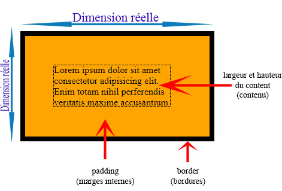

#Place occupée par un élément

Pour comprendre la place occupée par un élément, testons différents codes.

##Découverte #1

Exemple théorique :

Testez le code suivant :

  See the Pen <a href="https://codepen.io/Flolec/pen/bGXvwaa">
  Untitled</a> by Flolec (<a href="https://codepen.io/Flolec">@Flolec</a>)
  on <a href="https://codepen.io">CodePen</a>.

- Décommentez la ligne  `border:1px solid #000;` 

Que constatez-vous ?

- Adaptez la largeur du parent : `width : 404px;`

Que constatez-vous ?

- Décommentez la ligne  `padding:2px;` 

Que constatez-vous ?

- Quelle taille doit avoir le parent pour que ses deux enfants soient positionnés côte à côte ? 

##Modèle de boîte standard

Dans le flux courant, par défaut (**modèle de boîte standard**), la place occupée par un élément dépend de la somme de plusieurs propriétés :

- le contenu
- la bordure
- le padding (marges internes)

 

##Découverte #2

Exemple théorique :

Testez le code suivant :

  See the Pen <a href="https://codepen.io/Flolec/pen/OJKvRGQ">
  place occupée : modèle de boite standard</a> by Flolec (<a href="https://codepen.io/Flolec">@Flolec</a>)
  on <a href="https://codepen.io">CodePen</a>.

Comme nous l'avons vu précédemment, le parent n'est pas assez large pour contenir les deux articles côte à côte. Le parent a une largeur de 400px et chaque enfant possède une largeur de 206px (bordure gauche + padding gauche + largeur + padding droit + bordure droite).

Nous pourrions adapter la largeur du parent mais cela reste très fastidieux.

- Décommentez le code 
`*{
  box-sizing: border-box;
} `

- Qu'observez-vous ?

Note : 

Le sélecteur `*` en CSS, appelé sélecteur universel, sélectionne tous les éléments d'une page.

- **Usage commun** : Appliquer des styles de base à l'ensemble des éléments, comme la réinitialisation des marges ou l'utilisation de box-sizing: border-box.

- **Attention** : A utiliser avec parcimonie car il peut impacter la performance sur de très grandes pages en appliquant des styles globalement.

##Box-sizing

En définissant la propriété et sa valeur à `box-sizing: border-box;`, on change le comportement par défaut : la place occupée par un élément inclut désormais le contenu, les bordures et le padding. 

Cela signifie que :
 
- La **taille totale de l'élément reste celle spécifiée par la largeur et la hauteur éventuelle** dans le CSS, sans surprise liée aux bordures et au padding.
- **Avantages** : cette approche simplifie la mise en page et évite les débordements inattendus des éléments.

 
