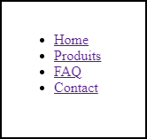

#Conteneur Flexbox<br>Display

##Conteneur Flex

Un conteneur Flex est une "boite" dont les éléments peuvent se dilater pour occuper tout l'espace ou au contraire, se contracter pour ne pas déborder hors du conteneur.

Un élément devient un conteneur Flex en spécifiant son rendu :

* `display: flex;` : le conteneur a, lui-même, un rendu "bloc"
* `display: inline-flex;` : le conteneur a, lui-même, un rendu "bloc en ligne"

Au sein du conteneur Flex, les éléments peuvent être disposés suivant un axe principal orienté verticalement (éléments en colonnes) ou horizontalement (éléments en lignes).

Hormis `<fieldset>`, `<button>` et `<textarea>`, n'importe quel élément HTML peut devenir un conteneur Flex.

<span class="red-text">Toutes les propriétés FlexBox ne sont interprétées que sur les éléments enfants directs d'un conteneur Flex ou sur le conteneur Flex lui-même !<span class="red-text">

###Exemple :  menu de navigation

 

!!! Abstract " Sur codePen "
    [<span class="editCpLong">CSS</span>  Le code complet à tester se trouve sur CodePen ](https://codepen.io/Flolec/pen/gOVzYKj){:target="_blank"}  


{ align=right }
``` html title="Menu html"
<nav>
    <ul>
        <li><a href="">Home</a></li>
        <li><a href="">Produits</a></li>
        <li><a href="">FAQ</a></li>
        <li><a href="">Contact</a></li>
    </ul>
</nav>
```


Les  `<li>`, étant des balises possédant un rendu de type block, sont  positionnés naturellement les uns au dessus des autres.

On désire que les balises `<li>` se positionnent côte à côte.  On va donc faire de leur parent direct un container de type *flexbox*.

{ align=left }
``` css title="CSS : containeur flexbox"
ul {
    display : flex;
}
```

??? note "Amélioration de la CSS"
	``` css title="CSS : containeur flexbox"
    li{
            list-style-type: none;
            margin : 0.5rem;
       }
    
    ```
Magique, non ?  Découvrons comment cela fonctionne en explorant les propriétés du conteneur et des éléments flex.


    