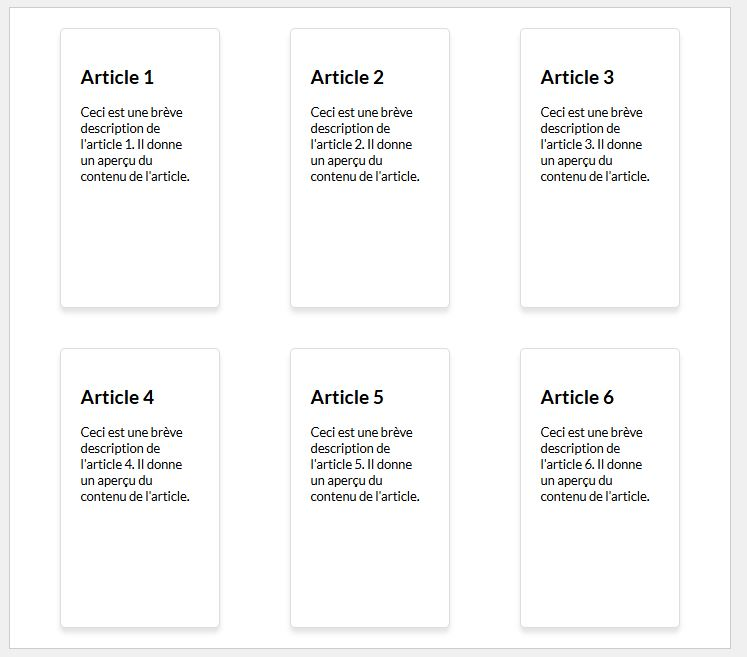
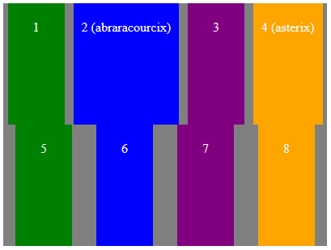
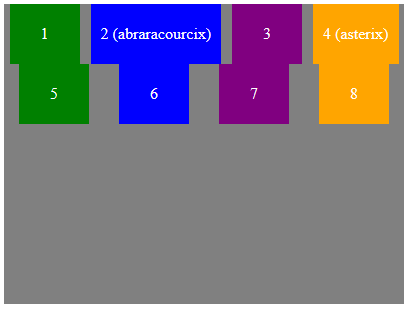
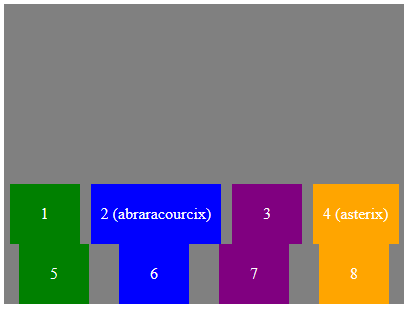
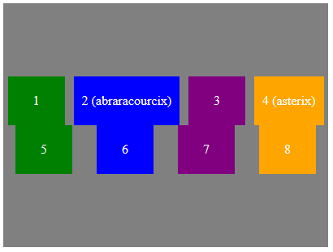
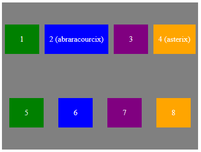
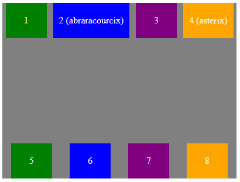

#Propriétés sur conteneur Flex<br>Align-content

##Découverte #1

###Exemple : Vignettes

!!! Abstract " Sur codePen "
    [<span class="editCpLong">CSS</span>  Le code complet à tester se trouve sur CodePen ](https://codepen.io/Flolec/pen/eYqrNWO?editors=1100){:target="_blank"}  


Assignons une hauteur minimum au conteneur flex. 

Par défaut, la hauteur de tous les enfants flex s'adapte pour occuper tout l'espace disponible.


Nous pouvons modifier ce comportement en utilisant la propriété `align-content` 
Testez cette propriété.
```css
align-content: flex-start;
```
Testez d'autres valeurs comme `center`, `flex-end`, `space-around`...
 

##Align-content

L'ensemble des lignes d'éléments n'occupent pas toujours l'entièreté de la taille du conteneur selon l'axe croisé. La propriété `align-content` indique comment répartir cet espace restant. Bien entendu, il faut pour cela autoriser la disposition des éléments en plusieurs lignes (flex-wrap) et que le conteneur ait une taille plus grande que l'ensemble des lignes d'éléments.

 
| propriété      | illustration |
| ----------- | ----------- |
| stretch (par défaut) :      |   |
| flex-start :      |   |
| flex-end :      |   |
| center  :      |  |
| space-around  :      |  |
| space-between  :      |  |
 

###Testez la propriété

<div class="containerFrame">
   <iframe  class="responsive-iframe" src="../../img/08_cssFlex/flexAlignContent.html" title="Testez la propriété" ></iframe>
</div>
 
