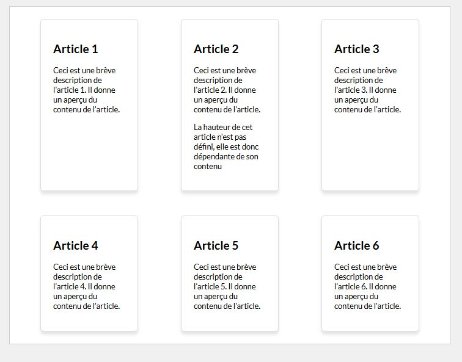
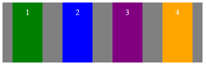
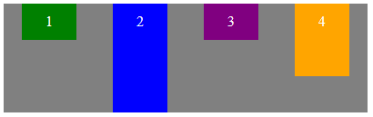
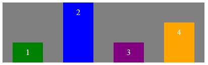
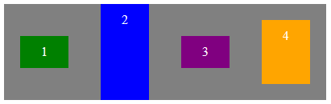
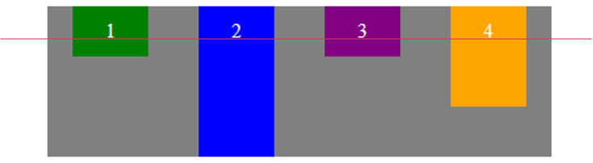

#Propriétés sur conteneur Flex<br>Align-items

##Découverte #1

###Exemple : Vignettes

!!! Abstract " Sur codePen "
    [<span class="editCpLong">CSS</span>  Le code complet à tester se trouve sur CodePen ](https://codepen.io/Flolec/pen/rNXvaoR){:target="_blank"}  


Augmentons le contenu de l'article 2. La hauteur de cet article n'étant pas défini, sa hauteur est donc dépendante du contenu.

Par défaut, la hauteur de tous les enfants flex s'adapte en fonction de la hauteur de l'enfant le plus grand.


Nous pouvons modifier ce comportement en utilisant la propriété `align-items` 
Testez cette propriété.
```css
align-items: flex-start;
```
Testez d'autres valeurs comme `center`, `baseline`, `center`...
 

##Align-items

La taille du conteneur selon l'axe croisé est soit fixée explicitement, soit déterminée par l'élément contenu le plus grand. La propriété `align-items` permet de déterminer comment doit être réparti l'espace restant selon l'axe croisé pour les éléments plus petits que le conteneur.

 
| propriété      | illustration |
| ----------- | ----------- |
| stretch (par défaut) :      |   |
| flex-start :      |   |
| flex-end :      |   |
| center  :      |  |
| baseline  :      |  |
 

###Testez la propriété

<div class="containerFrame">
   <iframe  class="responsive-iframe" src="../../img/08_cssFlex/flexAlignItems.html" title="Testez la propriété" ></iframe>
</div>
 
