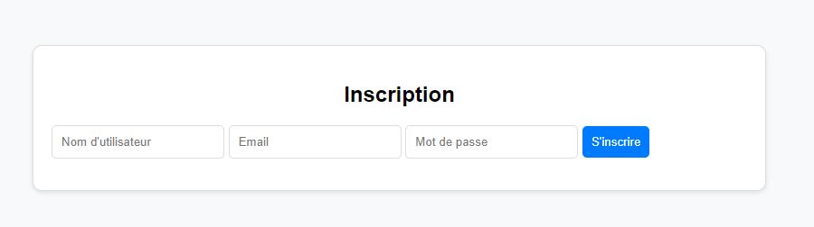
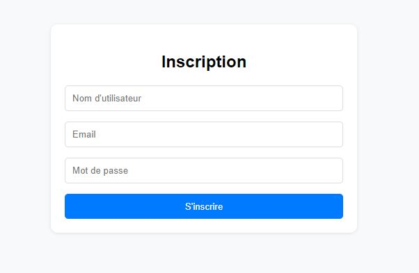
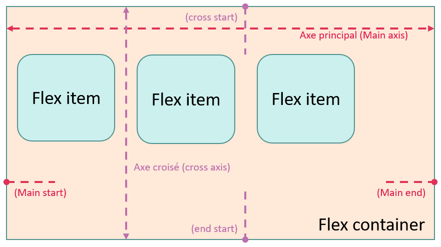
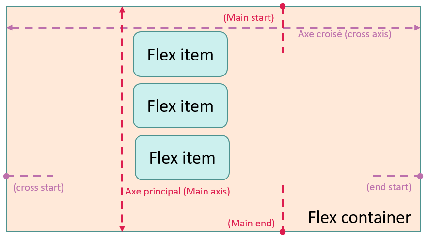

#Propriétés sur conteneur Flex<br>Flex-direction

##Découverte #1

###Exemple : menu

Le fait d'assigner la propriété `display:flex` à un élément dispose ses enfants directs côte à côte.

Comme nous l'avons vu précédemment, il n'est pas nécessaire de spécifier la direction.
[Revoir l'exemple >>](conteneur.md)

###Exemple : formulaire

!!! Abstract " Sur codePen "
    [<span class="editCpLong">CSS</span>  Le code complet à tester se trouve sur CodePen ](https://codepen.io/Flolec/pen/gOVeLzB){:target="_blank"}  


Prenons ce code html.

``` html title="Menu html"
<section class="form-container borderElement">
   <h1>Inscription</h1>
   <form class="registration-form cornerElement">
      <label for="nom">Votre nom (*) : </label>  
      <input type="text" id="nom" name="nom" placeholder="Nom d'utilisateur" required  >
      <label for="mail">Votre nom (*) : </label> 
      <input type="email"  id="mail" name="mail" placeholder="Email" required class="borderElement" >
      <label for="mdp">Votre mot de passe (*) : </label> 
      <input type="password" id="mdp" name="mdp" placeholder="Mot de passe" required  >
      <button type="submit"  >S'inscrire</button>
   </form>
</section>
```
 


Nous observons que les élements du formulaire se positionnent les uns à côté des autres.

Si nous désirons que les éléments se positionnent les uns-au-dessus des autres, nous allons 

* modifier le display de leur containeur
* modifier leur direction
 

``` css title="CSS : containeur flexbox"
.registration-form {
    display: flex;
    flex-direction: column; /* Aligne les enfants directs les uns au dessus des autres */  
}
```


Magique, non ?

??? note "CSS complète"
    ```css title="CSS : containeur flexbox"
    .registration-form {
        display: flex;
        /* Aligne les enfants directs les uns au dessus des autres */
        flex-direction: column;
    }

    /*************CSS décoration*****************/
    * {
        box-sizing: border-box;
    }

    body {
        font-family: Arial, sans-serif;
        background-color: #f8f9fa;
        font: size;
        : 0.75rem;
    }

    .borderElement,
    registration-form>input {
        border: 0.06rem solid #ddd;
    }

    .form-container {
        background-color: #fff;
        border-radius: 0.63rem;
        box-shadow: 0 0.06rem 0.31rem rgba(0, 0, 0, 0.1);
        padding: 1rem 3rem;
        max-width: 30rem;
        margin: 5rem auto;

    }

    .registration-form input {
        margin-bottom: 0.94rem;
        padding: 0.63rem;
        border: 0.06rem solid #ddd;
    }

    .registration-form button {
        padding: 0.63rem;
        border: none;

        background-color: #007bff;
        color: white;

        transition: background-color 0.3s;
    }

    .registration-form>*,
    .cornerElement {
        border-radius: 0.31rem;
    }

    .registration-form button:hover {
        background-color: #0056b3;
    }

    .registration-form label {
        font-size: small;
        margin-bottom: 0.5rem;
    }
    ```
    

##Flex-direction

La propriété `flex-direction` détermine la disposition des éléments dans leur conteneur, spécifiant l'axe principal et la direction (normale ou inversée) de ces éléments.

* **row (par défaut)**: axe principal horizontal, direction de gauche à droite,
* **row-reverse**: axe principal horizontal, direction de droite à gauche,



* **column**: axe principal vertical, direction de haut en bas,
* **column-reverse**: axe principal vertical, direction de bas en haut.



###Testez la propriété

<div class="containerFrame">
   <iframe  class="responsive-iframe" src="../../img/08_cssFlex/flexDirection.html" title="Testez la propriété" ></iframe>
</div>
 
