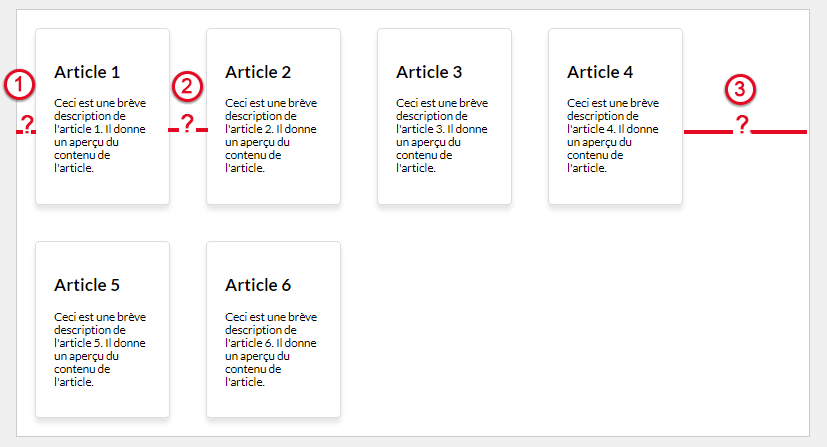
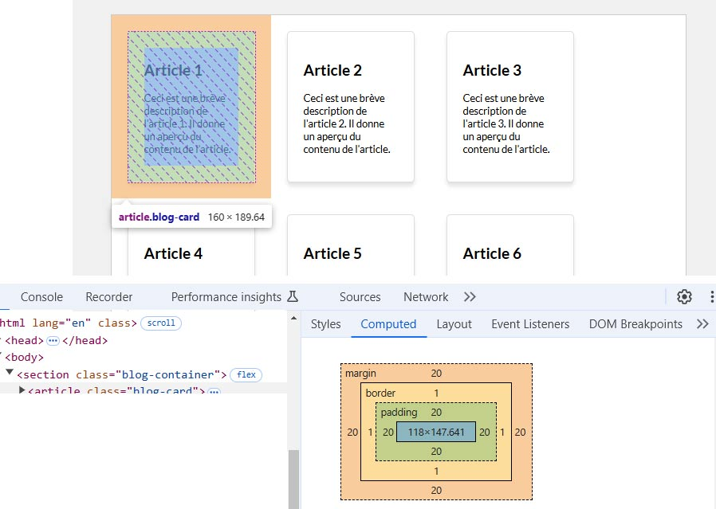

#Propriétés sur conteneur Flex<br>Justify-content

##Découverte #1

###Exemple : Vignettes

!!! Abstract " Sur codePen "
    [<span class="editCpLong">CSS</span>  Le code complet à tester se trouve sur CodePen ](https://codepen.io/Flolec/pen/BaXxagK){:target="_blank"}  


Partons de l'exemple précédent.
Nous remarquons que l'espace entre les vignettes n'est pas réparti équitablement entre les éléments.
A votre avis que vaut la valeur des espaces?  



??? question "Réponse >>"
    

	0. `/!\` nous sommes en `border-box`
    1. La valeur de la marge de gauche de la vignette : 1.25rem (20px)
	2. La valeur de la marge de gauche + la valeur de la marge de droite de la vignette : 2.50rem (40px)
	2. La largeur du blog-container - nbre de vignettes * (la largeur de la vignette + la valeur de la marge de gauche + la valeur de la marge de droite de la vignette ): 45rem - (3 * (10rem + 1.25rem + 1. 25rem )) = 7.50 rem

La propriété `justify-content` permet de gérer la répartition de l'espace restant.
Testez la propriété 

```css   
justify-content: space-evenly;
```

##Justify-content


Les éléments placés au sein du conteneur ne remplissent pas forcément tout l'espace. La propriété `justify-content` permet d'indiquer comment l'espace restant doit être réparti. Dans les images ci-dessous illustrant les différentes valeurs de cette propriété, chaque carré de couleur possède des marges.

 
| propriété      | illustration |
| ----------- | ----------- |
| flex-start (par défaut) :      |   |
| flex-end :      |   |
| center :      |   |
| space-between  :      |  |
| space-around  :      |  |
|  space-evenly  :      |  |
 
  

###Testez la propriété

<div class="containerFrame">
   <iframe  class="responsive-iframe" src="../../img/08_cssFlex/flexJustifyContent.html" title="Testez la propriété" ></iframe>
</div>
 
