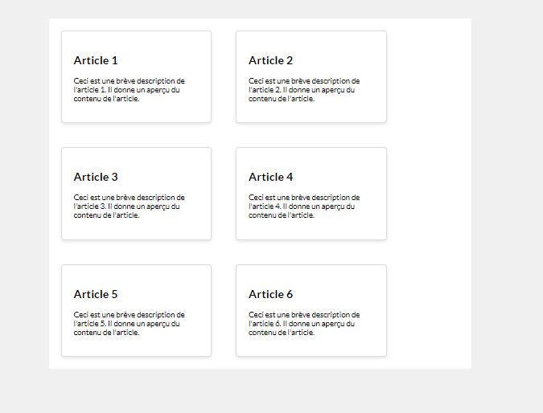
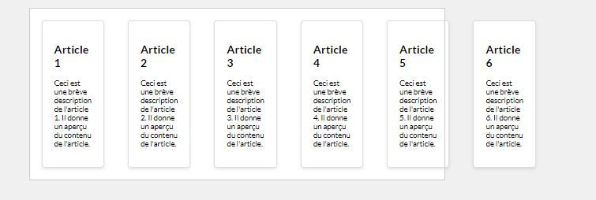
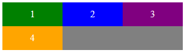
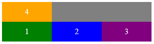

#Propriétés sur conteneur Flex<br>flex-wrap : 


##Découverte #1

###Exemple : Vignettes


!!! Abstract " Sur codePen "
    [<span class="editCpLong">CSS</span>  Le code complet à tester se trouve sur CodePen ](https://codepen.io/Flolec/pen/zYQQWxE){:target="_blank"}  


Nous désirons afficher des vignettes côte à côte.


Partons du code suivant : une section comprenant plusieurs articles

``` html title="Extrait HTML Vignette - Le code complet est dispo sur CodePen"
<section class="blog-container">
    <article class="blog-card">
        <h2>Article 1</h2>
        <p>Ceci est une brève description de l'article 1. Il donne un aperçu du contenu de l'article.</p>
    </article>
    <article class="blog-card">
        <h2>Article 2</h2>
        <p>Ceci est une brève description de l'article 2. Il donne un aperçu du contenu de l'article.</p>
    </article>
    [...]
</section>  
```
La section qui comprend les articles possède une largeur imposée. 
Par défaut, la largeur des articles dépend de leur contenu. Nous allons imposer une largeur aux articles. 
Étant donné que nous allons utiliser la propriété flex, nous allons utiliser la propriété spécifique `flex-basis`. Cette propriété spécifie la largeur initiale de l'élément flexible. Cette propriété sera vue en détail ultérieurement.

``` CSS title="Extrait CSS Vignette - Le code complet est dispo sur CodePen"
/*************start css position flex **********************/
.blog-container{
    width: 45rem;       
}

.blog-card {
  /*The flex-basis property specifies the initial length of a flexible item.*/
   flex-basis: 10rem;
}

```

Par défaut, les articles se positionnent les uns au dessus des autres.  
Nous désirons les placer côte à côte.

>> :question: La première question à se poser est : *Qui est le parent direct des éléments que nous désirons positionner côte à côte ?*

>> :octicons-megaphone-16:{ .blue-text } La section dont la class est `blog-container`.
Cet élément sera donc notre conteneur `flex`.


``` css title="CSS "
    .blog-container{
        display: flex;  
    }
```
Malheureusement, le rendu n'est pas au rendez-vous...

On observe que les vignettes déborde du conteneur.


Pourquoi ?

* Le conteneur `blog-container` a une largeur fixe
* Par défaut, les enfants flex se positionnent côte à côte sur une seule ligne.

On doit donc les autoriser à se placer côte à  côte sur plusieurs lignes avec la propriété `flex-wrap : wrap;`
``` css title="CSS "
    .blog-container{
        display: flex;  
        flex-wrap : wrap; 
    }

```
 
###Exemple : Vignettes inversées

 

Dans le code pen  modifiez   `flex-wrap : wrap;` en `flex-wrap : wrap-reverse;`

Que constatez-vous ?
 
``` css title="CSS "
.blog-container{
    display: flex;
    flex-wrap : wrap-reverse;    
}


```

##Flex-wrap

Étant donné que les éléments peuvent s'adapter à la taille du conteneur, la propriété `flex-wrap` va indiquer si la taille de ceux-ci doit être adaptée pour tenir sur une seule ou plusieurs lignes verticales ou horizontales en fonction de la direction de l'axe principal.

* **nowrap** (par défaut): les items sont placés sur une seule ligne dans le sens de l'axe principal

* **wrap**: les items sont placés en plusieurs lignes si nécessaire, celles-ci placées dans le sens de l'axe croisé,

* **wrap-reverse**: les items sont placés en plusieurs lignes si nécessaire, celles-ci placées dans le sens opposé de l'axe croisé.



###Testez la propriété

<div class="containerFrame">
   <iframe  class="responsive-iframe" src="../../img/08_cssFlex/flexWrap.html" title="Testez la propriété" ></iframe>
</div>
 
