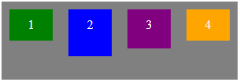
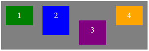

#Propriétés sur enfant Flex<br>align-self : 

Si la propriété align-items définit comment l'espace restant est réparti selon l'axe croisé pour tous les éléments, la propriété align-self fait de même pour un élément particulier. 

```css
.conteneur { align-items: flex-start; }
```



```css
.conteneur { align-items: flex-start; }
.item:nth-child(3){ align-self: flex-end; }
```


 