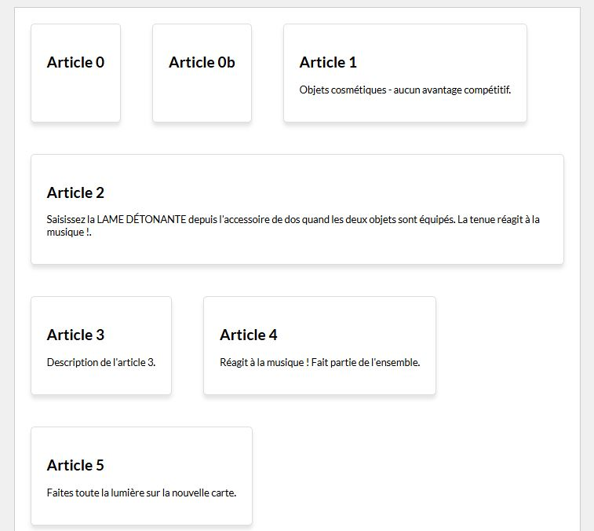

#Propriétés sur enfant Flex<br>flex-basis : 

##Découverte #1

###Exemple : Vignettes


!!! Abstract " Sur codePen "
    [<span class="editCpLong">CSS</span>  Le code complet à tester se trouve sur CodePen ](https://codepen.io/Flolec/pen/ExqRaqz?editors=1100){:target="_blank"}  

Observez le rendu et le code.
Comment les enfants flex se positionnent-ils par défaut ?

 

Ajoutez cette propriété aux enfants flex:

```html  hl_lines="2" linenums="1" 
.blog-card {
  flex-basis: 10rem;
}
```

Qu'observez-vous ? 
Vous pouvez bien évidemment gérer l'espace inoccupé via la propriété justify-content appliquée au conteneur flex.


##Découverte #2

###Exemple : Largeur calculée


!!! Abstract " Sur codePen "
    [<span class="editCpLong">CSS</span>  Le code complet à tester se trouve sur CodePen ](https://codepen.io/Flolec/pen/vYorONX?editors=1100){:target="_blank"}  

Observez le rendu et le code.
Les marges des vignettes ont été supprimées.
Nous désirons que les éléments se positionnent côte à côte deux par deux.  L'utilisation de la fonction calc() permet au navigateur de calculer la taille des enfants flex automatiquement.

Ajoutez cette propriété au enfant flex:

```html  hl_lines="2" linenums="1" 
.blog-card {
  flex-basis : calc(100% / 2); 
}
```
Vous pouvez tester avec 3,4...

Ajoutons maintenant des marges aux enfants flex.
Décommentez la ligne   `/* margin:   1.25rem ;*/`

Que se passe-t-il ? Pourquoi ?
A votre avis, comment pouvons-nous résoudre ce débordement ?

##Flex-basis

La propriété `flex-basis` permet de spécifier la taille par défaut de l'item avant que l'espace restant du conteneur ne soit réparti ou que les items ne soient réduits pour ne pas déborder du conteneur (si autorisé). La taille est exprimée selon les unités de tailles habituelles (auto, %, px, rem, ...).

Vous pouvez utiliser `calc()` avec flex-basis pour définir une taille initiale flexible en combinant des valeurs fixes et relatives.

```css    linenums="1" title="calc"
.item{
    flex-basis: calc(100% / 3 );
}
```
La taille de l'enfant flex sera la largeur totale de son parent / 3.

Si l'enfant flex possède des marges, il faut les supprimer.

```css    linenums="1" title="calc"
.item{
    margin : 1rem;
    flex-basis: calc((100% / 3) - 2rem)
}
```

* Définit la largeur initiale de chaque élément à un tiers de l’espace disponible (100% / 3), ce qui permet de placer trois éléments côte à côte dans le conteneur.

* Attention, on enlève l'espace occupé par les marges.  Pourquoi 2rem, alors qu'on a spécifé 1rem ? n'oubliez pas que margin: 1rem équivaut margin-top: 1rem + margin-right: 1rem + margin-bottom: 1rem + margin-left: 1rem.

>:warning: Attention, il faut laisser un espace entre l'opérateur et le nombre qui suit ! (calc(100%/30px) est incorrect !!)


