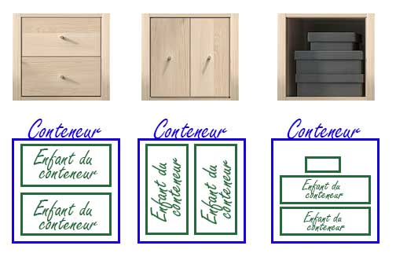

#Principes de base
Imaginez une armoire dans laquelle vous allez ranger des boites.  Votre armoire devient le conteneur qui contient des boites.

Le principe *Flexbox* repose sur ce principe très simple : on a un conteneur qui contient des éléments.  Ceux-ci peuvent être verticaux, horizontaux, ne pas occuper tout l'espace...

 

Si vous observez une interface web, vous pouvez la découper en **conteneurs** et **éléments enfants du conteneur**.

Mais un enfant de conteneur flex peut-il être lui-même conteneur flex ?

Vous connaissez le principe des poupées russées , (1) et bien flexbox part du même principe : un enfant d'un conteneur flex peut lui-même être un conteneur flex qui comprend de éléments enfants qui eux-même sont des conteneurs qui...
{ .annotate }

1.    Poupées russes ??? kesako ? [Explications poupées russes](https://fr.wikipedia.org/wiki/Poup%C3%A9e_russe){:target="_blank"}

*Exemple :*

<iframe width="560" height="315" src="https://www.youtube.com/embed/I1Pwb3jF5Jk?si=_J7D5XhovqY8fP6J" title="YouTube video player" frameborder="0" allow="accelerometer; autoplay; clipboard-write; encrypted-media; gyroscope; picture-in-picture; web-share" referrerpolicy="strict-origin-when-cross-origin" allowfullscreen></iframe>

