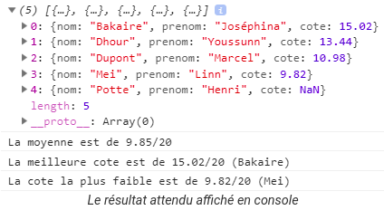

# Exercice

## Exercice js.arr1
Créez la fonction multiplesOccurences() qui reçoit un tableau d'entiers et retourne un tableau qui contient les valeurs présentes plus d'une fois.

S'il n'y en a pas, la fonction retourne un tableau vide.

```javascript
let tab = [5,2,36,9,45,5,7,6,12,9,26];
multiplesOccurences(tab); // [5,9]
let tab2 = [5,2];
multiplesOccurences(tab2); // []
```

## Exercice js.arr2

Créez la fonction differencesTables() qui reçoit deux tableaux de caractères et retourne un tableau avec les caractères qui ne sont pas présents en même temps dans les deux tableaux.

```javascript
let a = ["a","b","c","d","e","f"];
let b = ["a","b","j","j"];
let c = ["b","a"];
let d = [];
console.log(differencesTables(a,b)); //[ 'c', 'd', 'e', 'f', 'j', 'j' ]
console.log(differencesTables(a,c)); //[ 'c', 'd', 'e', 'f' ]
console.log(differencesTables(a,d)); //[ 'a', 'b', 'c', 'd', 'e', 'f' ]
console.log(differencesTables(a,a)); //[]
```


## Exercice js.arr3
Lors d'une manifestation de scouts d'une même troupe, vous recevez les participations des enfants aux activités d'orientation et du jeu de pistes sous forme de tableaux d'objets :


```javascript	
let course = [
        {totem: "Raton", nom: "PAHAYT", prenom: "Luc"},
        {totem: "Epagneul", nom: "MARTIJN", prenom: "Sven"},
        {totem: "Colibri", nom: "LING", prenom: "Riu"},
        {totem: "Ours", nom: "NGOMBE", prenom: "Dieumerci"},
        {totem: "Faucon", nom: "MALTESE", prenom: "Kurt"},
        {totem: "Tarentule", nom: "ARNEM", prenom: "Marthe"}
    ];
	
    let pistes = [
        {totem: "Impala", nom: "KALHDOUN", prenom: "Mohammed"},
        {totem: "Raton", nom: "PAHAYT", prenom: "Luc"},
        {totem: "Bison", nom: "VANDENHOUT", prenom: "Lauren"},
        {totem: "Epagneul", nom: "MARTIJN", prenom: "Sven"},
        {totem: "Kiwi", nom: "BENASSOUR", prenom: "Sarah"},
        {totem: "Faucon", nom: "MALTESE", prenom: "Kurt"},

    ];
```

En vous inspirant de l'exercice précédent, obtenez le listing des scouts qui n'ont pas participé aux deux activités. Triez ce listing selon les totems (Vous pouvez considérer que le totem identifie l'enfant).

```javascript	
console.log(differencesTablesActivites(course, pistes));
/* résultat affiché en console:
[
  { totem: 'Bison', nom: 'VANDENHOUT', prenom: 'Lauren' },
  { totem: 'Colibri', nom: 'LING', prenom: 'Riu' },
  { totem: 'Impala', nom: 'KALHDOUN', prenom: 'Mohammed' },
  { totem: 'Kiwi', nom: 'BENASSOUR', prenom: 'Sarah' },
  { totem: 'Ours', nom: 'NGOMBE', prenom: 'Dieumerci' },
  { totem: 'Tarentule', nom: 'ARNEM', prenom: 'Marthe' }
]
*/
```

## Exercice js.arr4

Un enseignant doit déterminer les cotes de fin d'année de ses étudiants:

| Nom     | Prénom    | Interro /20 | QCM /10 | Projet /20 | Examen /50 |
|---------|----------|-------------|---------|------------|------------|
| Bakaire | Joséphina | 15          | 8       | 13.9       | 38.2       |
| Dhour   | Youssunn | 16          | 4.6     | 14.7       | 31.9       |
| Dupont  | Marcel   | 8.5         | 7       | 12.6       | 26.8       |
| Mei     | Linn     | 6           | 7.5     | 13         | 22.6       |
| Potte   | Henri    | PP          | 2.6     | 8.2        | 16.6       |

Stockez les données dans un tableau d'objets et créez les fonctions nécessaires pour déterminer les cotes globales de chaque étudiant, la moyenne de la classe ainsi que la cote la plus haute et la plus basse parmi les étudiants qui ont passé toutes les épreuves.

La moyenne considère que les étudiants qui n'ont pas tout passé, ont une cote nulle.

```javascript	
let resultats = [
    {nom: "Bakaire", prenom: "Joséphina", interro: 15, qcm: 8, projet: 13.9, examen: 38.2},
    {nom: "Dhour", prenom: "Youssunn", interro: 16, qcm: 4.6, projet: 14.7, examen: 31.9},
    {nom: "Dupont", prenom: "Marcel", interro: 8.5, qcm: 7, projet: 12.6, examen: 26.8},
    {nom: "Mei", prenom: "Linn", interro: 6, qcm: 7.5, projet: 13, examen: 22.6},
    {nom: "Potte", prenom: "Henri", interro: "PP", qcm: 2.6, projet: 8.2, examen: 16.6}
];
```




## Exercice js.arr5

Calculer la moyenne des notes arrondies qui sont >= à 10. (c-à-d arrondir, garder supérieur ou égal à 10, calculer la moyenne)

Exemple: pour [10.7, 9.4, 8.7, 12.3, 9.8, 6.5, 13.7] vous devez obtenir le résultat de 11,75.

## Exercice js.arr6

En fin d'une soirée "team building" bien arrosée, suite à un pari perdu, vous vous êtes engagé à rembourser vos collègues du montant de l'entrée du concert, soit 25€. Vous avez utilisé une application sur votre smartphone pour que vos collègues vous communiquent leur numéro de compte bancaire. Voici ce que vous avez obtenu:

```javascript	
[
    {titulaire: 'Lucie LIU', compte: '972-487-086'},
    {titulaire: 'Marc KROSS', compte: '12-34567812-3456 70'},
    {titulaire: 'Désiré NGOMBE', compte: '4084-9027-8919-7157'},
    {titulaire: 'Lucie LIU', compte: '972-487-068'},
    {titulaire: 'Marc KROSS', compte: '12-34567812-3456 70'},
    {titulaire: 'Djamila HASSAN', compte: '4084-9027-8919-7175'},
    {titulaire: 'John FLY', compte: '499 273-987 16'},
    {titulaire: 'Leif HARALDSON', compte: '499 273-987 17'},
    {titulaire: 'Désiré NGOMBE', compte: '4084-9027-8919-7157'},
    {titulaire: 'Natalia PETROCHKAIA', compte: '12-34567812-3456 78'},
    {titulaire: 'Marc KROSS', compte: '12-34567812-3456 70'}
]
```
Avant d'effectuer vos versements, vous souhaitez pouvoir filtrer cette liste pour retirer les doublons ainsi que les numéros de compte incorrects (La vérification des numéros de compte utilise [l'algorithme de Luhn](https://en.wikipedia.org/wiki/Luhn_algorithm). Essayez de programmer cet algorithme par vous-même au lieu de copier une des solutions présentes sur [http://rosettacode.org](http://rosettacode.org).).

Voici ce que vous devriez obtenir:

```javascript
Le numéro de compte 972-487-086 de Lucie LIU est valide
Le numéro de compte 12-34567812-3456 70 de Marc KROSS est valide
Le numéro de compte 4084-9027-8919-7157 de Désiré NGOMBE est valide
Le numéro de compte 499 273-987 16 de John FLY est valide
```
