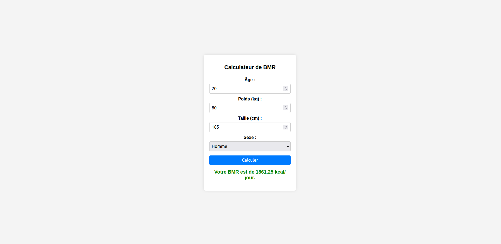
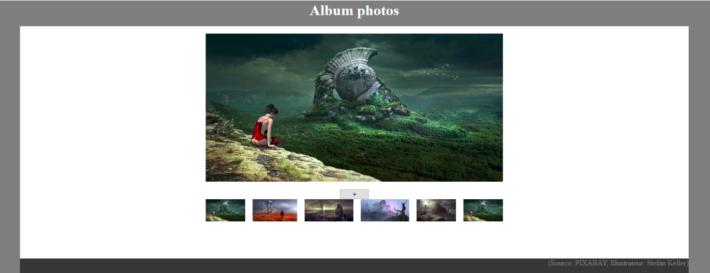

# Exercices

## Exercice 1 : compteur
Sur base des fichiers fournis dans l'archive "[ExerciceCounter.zip](../img/12_jsDOM/ExerciceCounter.zip)", créez le script.js pour que le bouton "+" incrémente le compteur, le bouton "-" le décrémente et le bouton "Reset" le remette à zéro.

## Exercice 2 : liste dynamique
Sur base des fichiers fournis dans l'archive "[ExerciceGenerateListe.zip](../img/12_jsDOM/ExerciceGenerateListe.zip)", adaptez le script.js pour que la liste de fruits présente dans le tableau soit affichée dynamiquement dans la page au chargement (utilisez un forEach).

## Exercice 3 : sélection de carte
Sur base des fichiers fournis dans l'archive "[ExerciceSelectCard.zip](../img/12_jsDOM/ExerciceSelectCard.zip)", créez le script.js pour qu'un clic sur une carte la sélectionne (une ombre autour de la carte doit apparaître). Un second clic sur la même carte la désélectionne (l'ombre disparait).

## Exercice 4 : ajouter un bouton qui supprime l'élément
Sur base des fichiers fournis dans l'archive "[ExerciceDeleteOnItem.zip](../img/12_jsDOM/ExerciceDeleteOnItem.zip)", créez le script.js pour qu'un bouton "Supprimer" soit ajouté à chaque élément de la liste. En cliquant dessus, l'élément correspondant disparaît de la page.

## Exercice 5 : plusieurs tris
Sur base des fichiers fournis dans l'archive "[ExerciceSortList.zip](../img/12_jsDOM/ExerciceSortList.zip)", créez le script.js pour que les boutons trient la liste : par nom (ordre alphabétique), par rang et par prix (ordre croissant).

## Exercice 6 : BMR
Le BMR (Basal Metabolic Rate, en français Taux Métabolique de Base - TMB) représente la quantité minimale d'énergie (exprimée en kilocalories par jour) dont le corps a besoin pour fonctionner au repos.

Le BMR dépend de plusieurs facteurs :

- **Âge** : Plus on vieillit, plus le métabolisme ralentit.
- **Sexe** : En général, les hommes ont un BMR plus élevé que les femmes en raison de leur masse musculaire plus importante.
- **Poids et taille** : Un corps plus grand et plus lourd nécessite plus d'énergie pour fonctionner.

Pour le calculer nous utilisons la **formule de Mifflin-St Jeor** :

- Pour les hommes : BMR = 10 * poids(kg) + 6.25 * taille (cm) + 5* âges (années) + 5

- Pour les femmes : BMR = 10 * poids(kg) + 6.25 * taille (cm) + 5* âges (années) - 161

Sur base du fichier HTML fournies dans l'archive "[BMR.zip](../img/12_jsDOM/BMR.zip)", réaliez le calcul du BMR avec les fonctionnalités suivantes :

- L'utilisateur encode les valeurs des différents champs et appuie sur le bouton calculer, le programme affiche en vert "Votre BMR est de xxxxx kcal/jour."

- Si il manque des informations ou si certaines ne sont pas correctes, le programme affiche en rouge "Veuillez entrer des valeurs valides."

**Astuce** : pour récupérer [les valeurs d'un champs input](https://www.w3schools.com/jsref/prop_text_value.asp).

## Exercice 7 : fantasy

Sur base du fichier HTML et des images fournies dans l'archive "[fantasy.zip](../img/12_jsDOM/fantasy.zip)", réalisez la visualisation d'un album photo avec les fonctionnalités suivantes:

- Il existe 5 images nommées 'fantasy-1.jpg', ..., 'fantasy-5.jpg',

- L'album permet de voir une image en grand et d'ajouter une à une des vignettes d'aperçu (images en petit format),
    
- Au départ, seule la première vignette est visible. L'image est affichée également en grand format,
    
- Au clic sur le bouton d'ajout, une vignette supplémentaire est ajoutée et l'image remplace celle affichée en grand format,
    
- À partir de la sixième vignette, la suite des vignettes recommence à 1,
    
- Lorsque 10 vignettes ont été affichées, le bouton d'ajout disparaît,

- Au clic sur une des vignettes, son image remplace celle affichée en grand format.

