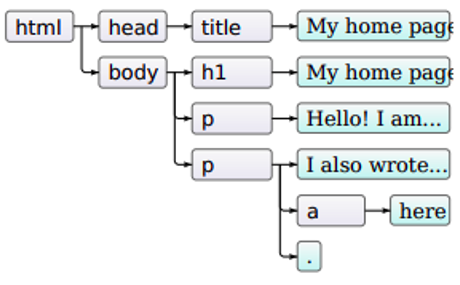
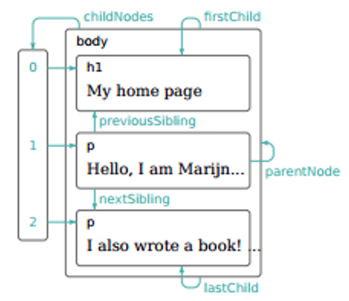

# Introduction

Le DOM (Document Object Model) est une représentation hiérarchique d'une page web sous forme d'arbre. Chaque élément HTML (balises, attributs, texte) est transformé en un objet accessible via JavaScript. Cela permet aux scripts de naviguer dans la structure du document, d'ajouter, modifier ou supprimer des éléments dynamiquement.

JavaScript permet d'interagir avec le DOM en temps réel. Il peut modifier le contenu (changer du texte ou des images), ajouter ou supprimer des éléments, modifier les styles CSS, ou encore réagir aux événements comme un clic ou une saisie clavier. Cette capacité fait de JavaScript un langage essentiel pour rendre les pages web interactives et dynamiques.

Historiquement, le langage Javascript a d'abord été conçu pour être exécuté au sein des navigateurs.

Les utilisations de JS sont multiples :

- Modification du DOM
    - Renforcement expérience utilisateur
    - Formulaires adaptables
- Validation de formulaire
    - Avantage: évite des requêtes inutiles vers le serveur,
    - MAIS: l'utilisateur peut désactiver ou contourner cette validation =>
    - Toujours valider les données aussi côté serveur!

## Rappel : JS et web

Il y existe au moins 3 façons différentes d'inclure du JS dans une page web.

### Directement dans la page

```html
<script><![CDATA[
// votre code Javascript
]]></script>
```

La délimitation `<![CDATA[ ... ]]>` permet de ne pas provoquer d'erreur d'interprétation par le navigateur si Javascript est désactivé.

### Dans un fichier *.js externe
```html
<script src="../../scripts/util.js"></script>
```

C'est généralement la technique à privilégier par défaut. 


### Dans un attribut gestionnaire d'évènement HTML
```html
<button onclick="send_data();">
```
Cette méthode permet d'appeller une fonction `send_data()` lors du click d'un bouton. Si le code appelé est assez simple, cette technique est suffisante. Sinon, il vaut mieux isoler le code JS du code HTML en spécifiant les événements à capturer; ce qui sera présenté dans la suite du tutoriel.

Notez qu'il existe une quatrième méthode que nous ne discuterons pas ici.

### Synchronisation

Lorsqu'un navigateur rencontre la balise `<script>`, il interrompt par défaut l'interprétation du code HTML pour charger et exécuter directement le script JS avant de poursuivre l'interprétation de la suite du code HTML.

Cela implique d'insérer les balises `<script>` dans un ordre qui respecte leurs dépendances éventuelles... mais également de tenir compte que l'entièreté de la page n'a pas encore été complètement chargée par le navigateur.

Pour s'assurer que la page soit entièrement chargée avant d'exécuter les scripts JS, un première technique est d'insérer ses scripts comme derniers éléments de la balise `<body>`.

!!! Tip "Inclusion de script"
    Créez un fichier "texte.js" avec le code suivant:
    ```javascript    
        function changeTexte(){
            document.getElementById('texte').innerHTML = 'Ce texte remplace le texte initial';
        }
    ```
    Créez un fichier "chargement.html" avec le code suivant:
    ```html
    <!DOCTYPE html>
    <html lang="fr">
    <head>
        <meta charset="utf-8">
        <title>Test de chargement de script JS</title>
        <script src="./texte.js"></script>
        <script>
            changeTexte();
        </script>
    </head>
    <body>
        <h1>Chargement</h1>
        <p id="texte">Le texte n'a pas été changé...</p>
    </body>
    </html>
    ```
    Testez la page "chargement.html" en l'ouvrant dans un navigateur avec les outils de développement. Que constatez-vous ?

    ??? note "Réponse"
        Le texte initial n'a pu être changé car le script "changeTexte()" a été exécuté avant que le paragraphe "#texte" ne soit interprété par le navigateur => en console, une exception JS apparaît.

        À présent, déplacez la balise `<script>` contenant l'appel à "changeTexte()" juste avant la fermeture du <body> et rechargez la page. Vous pouvez constater que le texte a bien été changé.

### Defer

Comme signaler plus tôt, l'utilisation de defer comme attribut d'une balise `<script>` qui charge un script depuis une autre source (attribut src !) va forcer le navigateur à poursuivre l'interprétation du code HTML tout en chargeant le script en parallèle et d'attendre l'interprétation complète du code HTML avant d'exécuter le script. L'ordre d'exécution des scripts respecte néanmoins leur ordre d'apparition dans le code HTML.

Mais ce n'est pas la seule façon de faire, il existe d'autres attributs.

### async
L'utilisation de async comme attribut d'une balise `<script>` qui charge un script depuis une autre source (attribut `src` !) va également forcer le navigateur à poursuivre l'interprétation du code HTML tout en chargeant le script en parallèle. Par contre, dès que le script est chargé, il est exécuté et l'interprétation du code HTML est suspendue durant l'exécution du script. L'ordre d'exécution des scripts chargés de manière asynchrone peut évidemment varier.

## DOM
### Objet global: Window
En JS, l'objet global dépend de l'environnement. Dans un navigateur, l'environnement global correspond à l'onglet (fenêtre) courant; c'est l'objet `Window` (voir la liste de ses propriétés et méthodes).

Propriétés particulières:

- location: URL courante sous forme d'un objet Location (href, protocol, host, hostname, port, …), ancre comprise.

- document: Objet Document (DOM), 

```javascript
// Afficher l'URL actuelle dans la console
console.log(window.location.href);

// Rediriger l'utilisateur vers une autre page après 3 secondes
setTimeout(() => {
    window.location.href = "https://www.example.com";
}, 3000);

// Modifier dynamiquement le titre de la page
window.document.title = "Nouveau Titre de la Page";
```


### Objet Document

L'objet [Document](https://developer.mozilla.org/fr/docs/Web/API/Document) représente les méta-données et le contenu d'une page web chargée par le navigateur.

Quelques unes de ses propriétés et méthodes:

- `forms`: tableau des formulaires

- `images`: tableau des images
    
- `links`: tableau des hyperliens (`<area>`, `<a>`)
    
- `lastModified`: date de dernière mise à jour
    
- `location`: url du document
    
- `referrer`: url de l'historique -1

- `write(arg)`: écrire dans le document

```javascript
document.write("L'URL courante est : "+document.location+"<br> et vous venez de : "+document.referrer+"");
```

### Document Object Model
À la réception d'une page HTML, le navigateur lit le document et construit une représentation en arbre des balises HTML : le Document Object Model.

Cette représentation facilite le rendu de la page et la manipulation ultérieure de la page par des scripts clients.

#### Vue du code HTML

```html
<!DOCTYPE html>
<html>
    <head>
        <title>My home page</title>
    </head>
    <body>
        <h1>My home page</h1>
        <p>Hello, I am Marijn and this is my home page.</p>
        <p>I also wrote a book! Read it <a href="http://eloquentjavascript.net">here</a>.</p>
    </body>
</html>
```

#### Vue de la représentation en arbre



### Un peu de terminologie...

- document: ensemble de l'arborescence,
    
- element: un élément de l'arborescence HTML; c'est-à-dire une balise HTML avec son contenu;

- node: nœud de l'arborescence DOM, par exemple `<p>bonjour</p>` est à la fois un élément et un nœud.. Par contre, `bonjour` est un nœud mais pas un élément.



Bien connaitre ces termes est nécessaire pour comprendre les méthodes de parcours et manipulation du DOM.
