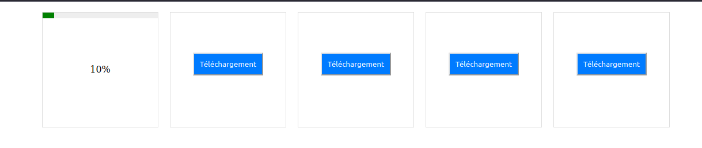
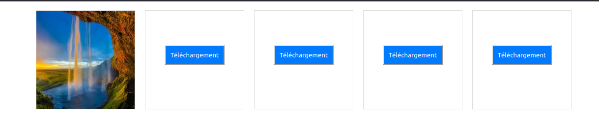
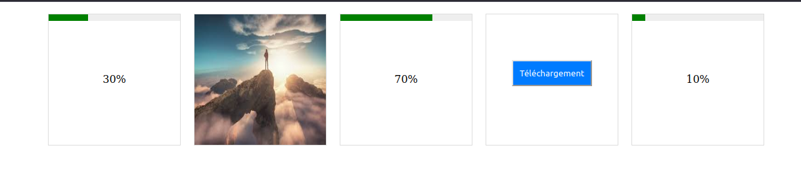

# Exercice

## Exercice 1 : Création d'un compteur dynamique

Commencez par récupérer le code HTML et CSS [ici](../img/13_jsAsynchrone/compteurDynamique.zip).

L'objectif est d'écrire un code permettant de faire incrémenter le compteur de 1 à chaque seconde. Quand l'utilisateur le souhaite, il peut cliquer sur le bouton "Ajouter 10" pour que le compteur s'incrémente directement de 10. Le bouton "Redémarrer" réinitialise le compteur à 0.

!!! Tip "Question"
    Doit on utiliser le mot clé `async` ici ? Pourquoi ?

??? note "Astuce"
    Pour résoudre ce problème, vous pouvez utiliser `setTimeout`. Mais il est aussi possible d'utiliser une autre fonction asynchrone : `setInterval` voir la [documentation](https://www.w3schools.com/jsref/met_win_setinterval.asp).

## Exercice 2 : Fake Download

Commencez par récupérer le code HTML et CSS [ici](../img/13_jsAsynchrone/FakeDownload.zip).

Le fichier HTMl contient 5 vignettes. Au départ, dans ces vignettes, seul un bouton "téléchargement" est visible. Votre objectif est que quand l'utilisateur clique sur l'un de ces boutons, celui-ci disparaît et pour le remplacer apparaît une barre de téléchargement ainsi que le pourcentage 0%. 

À chaque seconde, la barre de téléchargement et le nombre augmentent de 10%. 

Quand la barre de téléchargement est complète et donc que le nombre est arrivé à 100% ceux-ci disparaissent et laissent place à l'image. 

L'idée est que ce comportement soit asynchrone de telle sorte que l'utilisateur peut appuyer sur d'autres boutons téléchargement pendant le téléchargement d'une image.

Réalisez le code JavaScript pour obtenir ce comportement, utiliser `async` et `await`.

??? note "Astuce"
    Pour faire grandir la barre de téléchargement, vous pouvez faire en sorte que son `width` augmente de 10% à chaque seconde.
