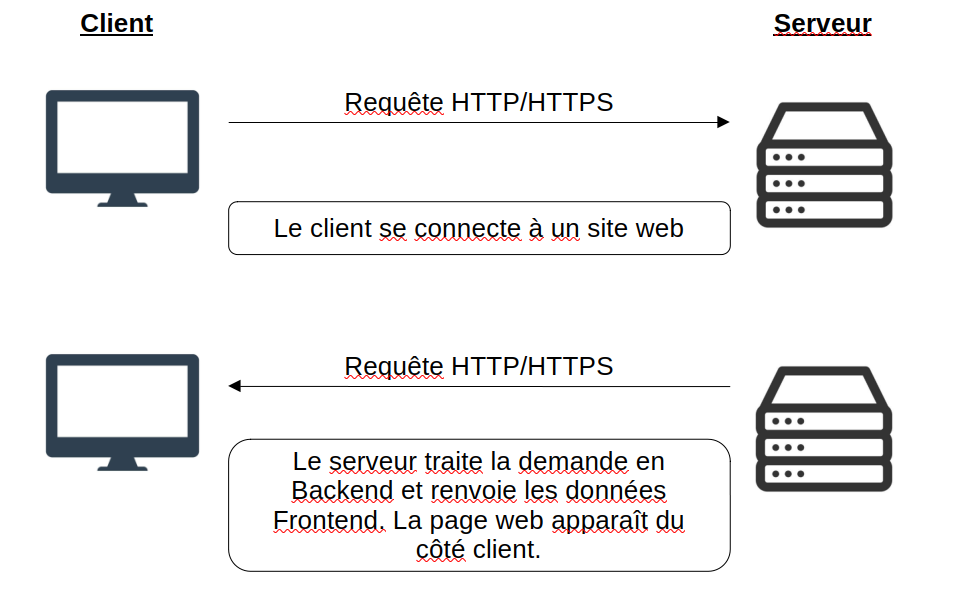
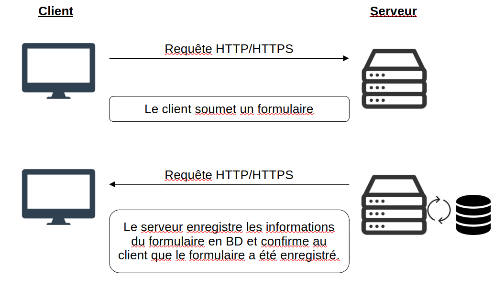

# Introduction

## 1.1 Frontend & Backend

Jusqu'à présent, nous avons uniquement travaillé sur la **partie visible d’un site web**, c’est-à-dire le **frontend**. Le frontend correspond à tout ce que voit et utilise l’utilisateur dans son navigateur : les pages HTML, le style avec CSS, les interactions dynamiques avec JavaScript, etc.

Mais un site web moderne ne se limite pas à cela. Il interagit très souvent avec une **partie invisible**, qui tourne en arrière-plan sur une machine distante : c’est ce que l’on appelle le **backend**.

Le **backend** est responsable de nombreuses tâches essentielles :

- Stocker et récupérer des données depuis une base de données

- Appliquer des règles de gestion (authentification, calculs, logique métier…)

- Répondre aux demandes envoyées par le frontend (ex : afficher un profil, envoyer un message…)

Alors que le **frontend s’exécute dans le navigateur de l’utilisateur**, le **backend s’exécute sur un serveur**. Le serveur peut être un ordinateur dans un datacenter, ou même votre propre PC pendant la phase de développement.

Sur l’image ci-dessous, vous pouvez voir comment un client se connecte à un serveur.
Il envoie d’abord une requête HTTP ou HTTPS pour demander au serveur d’obtenir la page web (frontend).
Le serveur traite cette demande via le backend, puis renvoie au client la page web (c’est-à-dire le frontend : HTML, CSS, JS) par une réponse HTTP ou HTTPS.

Dans ce cours, nous allons **découvrir et créer notre premier backend**. Jusqu’à présent, notre site ne communiquait avec aucun serveur. Tout se passait côté navigateur.  
Nous allons maintenant **ajouter cette couche serveur**, et voir comment elle peut **réagir aux demandes du frontend**, pour produire un site plus dynamique et connecté.

Pour que le **client** (le navigateur) et le **serveur** puissent communiquer, ils utilisent un protocole : c’est ce qu’on appelle **HTTP** (*HyperText Transfer Protocol*).  
Ce protocole permet d’envoyer des requêtes (demandes) et de recevoir des réponses, sous forme de textes, de fichiers, de données JSON, etc.

Lorsque vous ouvrez un site web, votre navigateur envoie une **requête HTTP** au serveur (ex. : "donne-moi la page d’accueil"), et le serveur répond avec le contenu demandé.

Il existe une version sécurisée de ce protocole, appelée **HTTPS** (*HTTP Secure*), qui ajoute un **chiffrement des données** grâce à un certificat SSL.  
Cela signifie que les informations échangées entre le client et le serveur sont cryptées, donc **protégées contre les interceptions** (ce qui est essentiel pour des données sensibles comme les mots de passe, les coordonnées bancaires, etc.).

## 1.2 Node.js comme solution Backend

Maintenant que l’on comprend mieux ce qu’est le **backend**, la question est : **avec quoi peut-on le construire ?**

Il existe plusieurs technologies permettant de créer un serveur backend (comme PHP, Python avec Django ou Flask, Ruby, Java, etc.), mais dans ce cours, nous allons utiliser une technologie moderne et populaire : **Node.js**.

**Node.js** est un environnement d’exécution JavaScript côté serveur.  
Autrement dit, il nous permet d’utiliser **le même langage que dans le navigateur (JavaScript)** pour faire fonctionner un serveur.  
C’est une grande force pour nous, car nous avons déjà appris à écrire du JavaScript côté client : nous allons donc pouvoir réutiliser ce que nous connaissons !

Avec **Node.js**, nous allons pouvoir :
- Créer un **serveur** capable de recevoir et de répondre à des requêtes HTTP ou HTTPS ;
- **Traiter ces requêtes** (par exemple, comprendre ce que demande un utilisateur, analyser un formulaire, générer une réponse) ;
- Et plus tard, **connecter notre serveur à une base de données**, ou à d’autres services.

Node.js est aujourd’hui utilisé par de nombreuses grandes entreprises pour faire fonctionner des sites web modernes. C’est une solution rapide, légère et efficace, particulièrement bien adaptée pour créer des API (des interfaces permettant à des sites web ou des applications de communiquer avec un serveur).

Dans les prochaines sections, nous allons installer Node.js sur notre machine, puis commencer à écrire nos premiers programmes côté serveur.

## 1.3 Architecture web

Pour bien comprendre comment un site web fonctionne dans son ensemble, il est utile d’avoir une vision d’ensemble de l’**architecture web** classique.  
Un site web moderne est souvent constitué de plusieurs parties qui travaillent ensemble :

1. **Le client**  
   C’est ce que l’utilisateur utilise : un navigateur (comme Chrome, Firefox, etc.). Il envoie des requêtes au serveur (par exemple, "je veux voir la page d’accueil", ou "je veux m’inscrire"), et reçoit des réponses (du texte, des images, des données...).

2. **Le serveur (backend)**  
   C’est la machine qui reçoit les requêtes du client, les comprend, exécute la logique nécessaire, puis envoie une réponse.  
   Le serveur peut, par exemple, vérifier un mot de passe, enregistrer un message, ou récupérer des informations dans une base de données.

3. **La base de données**  
   C’est l’endroit où l’on stocke les données du site : comptes utilisateurs, messages, produits, etc.  
   Le serveur est le seul à pouvoir accéder à la base de données : le client ne peut pas y accéder directement (pour des raisons de sécurité).

L’image ci-dessous montre un client naviguant sur un site web, souhaitant soumettre un formulaire (par exemple, pour créer un compte).
Le formulaire est envoyé au serveur via une requête HTTP ou HTTPS.
Le serveur traite cette demande côté backend : si le formulaire est correctement rempli, les informations sont enregistrées dans une base de données.
Ensuite, le serveur renvoie une réponse au client pour lui indiquer que les données ont bien été sauvegardées.

Cette séparation permet de **mieux organiser le code** et de **sécuriser les données**.  
Le client s’occupe uniquement de l’affichage et des interactions utilisateur, tandis que le serveur gère la logique et l’accès aux données.

