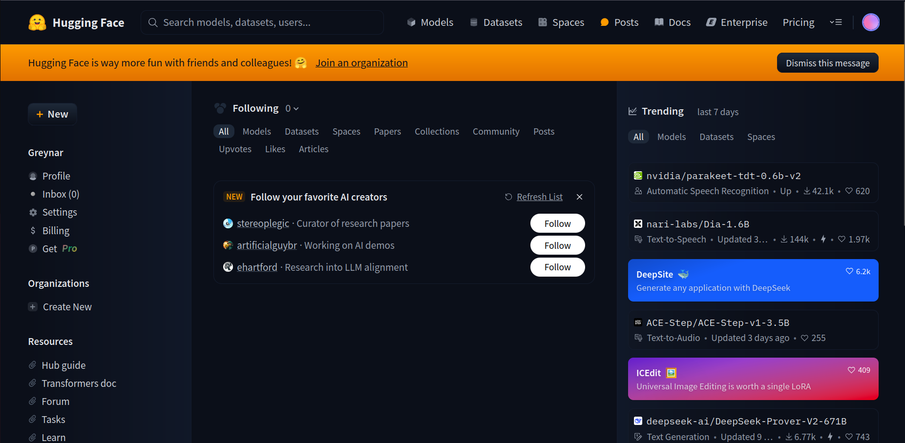
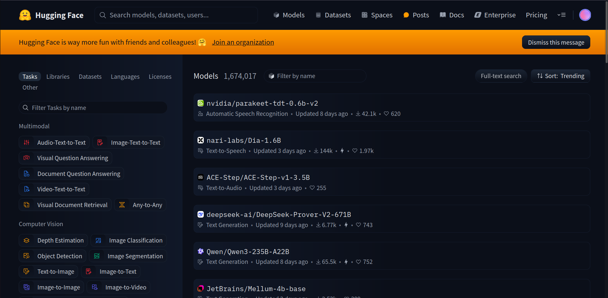
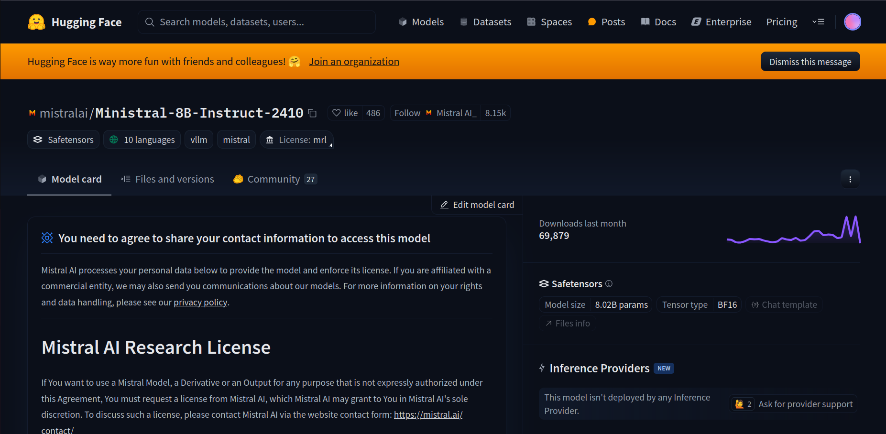
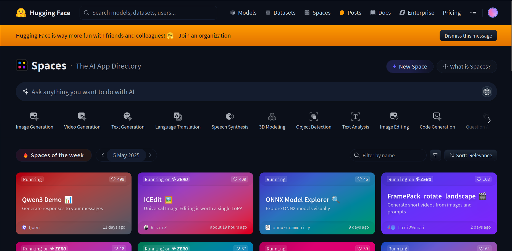
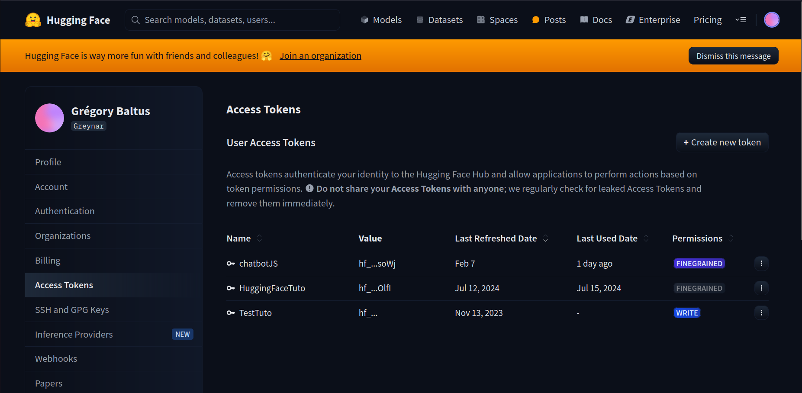
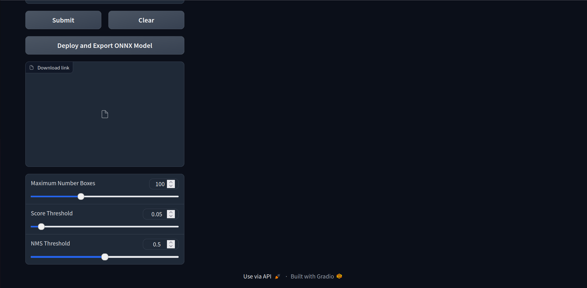

# Hugging Face

## 3.1 – Présentation de Hugging Face

[Hugging Face](https://huggingface.co) est une plateforme très populaire qui regroupe des **modèles d'intelligence artificielle** (IA) prêts à l’emploi, proposés par la communauté et par des entreprises spécialisées.

Son objectif principal est de démocratiser l'accès à l'IA, en permettant à n'importe qui de tester, utiliser, et intégrer des modèles performants dans ses propres applications. C'est un site que vous utiliserez beaucoup dans la suite de vos études et dans votre carrière professionnelle. 

###  Petit historique

Hugging Face a été fondé en 2016 par Clément Delangue, Julien Chaumond et Thomas Wolf, d'abord comme une start-up spécialisée dans la création d’un chatbot social basé sur l’intelligence artificielle.

Leur premier modèle était un **chatbot en langage naturel** destiné au grand public, mais très vite, l’entreprise s’est orientée vers le développement de **bibliothèques open source** destinées aux chercheurs et développeurs en traitement automatique du langage (NLP).

C’est en 2019 que Hugging Face a connu une forte croissance, notamment grâce à sa bibliothèque Python nommée **Transformers**, qui permet de facilement utiliser des modèles de type BERT, GPT, T5, etc. dans ses propres scripts Python.

Aujourd’hui, Hugging Face est reconnu comme l’un des acteurs majeurs de l’IA open source, et propose :

- une **bibliothèque Python très utilisée dans le monde de la recherche**,

- un **site web** qui centralise des milliers de modèles, jeux de données et démonstrations,

- une **API d’accès aux modèles**, utilisable depuis des applications web ou mobiles,

- et une plateforme collaborative où les utilisateurs peuvent **partager leurs propres modèles** et expérimentations.


### Page d'accueil



Sur la page d’accueil, vous pouvez :

- rechercher des modèles, des datasets, ou des espaces interactifs,

- voir les modèles les plus populaires ou récents,

- créer un compte pour commencer à interagir avec les outils.

**À noter** : vous devrez vous connecter avec un compte gratuit pour générer une clé d’API plus tard.

---

### Page "Models"



La page **Models** propose des milliers de modèles d’IA partagés par la communauté.

Vous pouvez y trouver des modèles pour :

- **le traitement du langage naturel** (chatbot, résumé, classification…),

- **la génération d’image** (type DALL·E, Stable Diffusion…),

- **la reconnaissance vocale**,

- et bien d'autres domaines.

Chaque modèle a sa propre fiche, souvent avec un bouton "Try it out" qui permet de **tester le modèle directement dans le navigateur**.

---

### 🔍 Fiche d’un modèle



Lorsque vous cliquez sur un modèle, vous accédez à sa page de présentation. On y trouve :

- une **description du modèle** et de son fonctionnement,

- un champ pour **faire un test interactif** (entrer une phrase ou une image),

- des **informations techniques** (auteur, licence, taille, instructions d’utilisation…),

- parfois des exemples de requêtes API pour utiliser le modèle dans vos propres applications.

Certains modèles sont très puissants et nécessitent une clé API valide pour être utilisés en dehors du site.

### Page "Spaces"



Les **Spaces** sont des mini-applications interactives créées avec des modèles Hugging Face.

Vous pouvez :

- **tester des chatbots**, des outils de génération de texte ou d’image,

- **soumettre vos propres inputs** (texte, image, audio…),

- **voir le code source** utilisé pour créer ces démos.

C’est un excellent moyen d’explorer les possibilités de l’IA, même sans écrire de code.

**Nous vous encourageons vivement à explorer cette partie du site** : testez plusieurs espaces, comparez les résultats, et inspirez-vous des idées proposées.


### Page "Access Tokens"



Pour utiliser les modèles Hugging Face dans une application (comme un site web), vous aurez besoin d’une **clé d’API personnelle**, appelée *Access Token*.

Pour la générer :

1. Créez un compte ou connectez-vous.

2. Accédez à [huggingface.co/settings/tokens](https://huggingface.co/settings/tokens).

3. Cliquez sur **New token**, donnez-lui un nom et sélectionnez le bon niveau d’accès (souvent "read").

Cette clé est nécessaire pour authentifier vos appels API (nous verrons comment l’utiliser dans la suite du cours).

**Attention** : cette clé est personnelle. Ne la partagez pas et ne l’intégrez jamais directement dans un script frontend accessible **publiquement**.


### En résumé

Hugging Face est une **boîte à outils centrale** pour travailler avec l’IA moderne :

- Elle permet d’**accéder facilement à des modèles performants**,

- De **les tester directement** dans le navigateur,

- Et de les **intégrer dans ses propres projets** via une API.

C’est l’endroit idéal pour **explorer**, **expérimenter**, et **intégrer** des modèles d’intelligence artificielle dans des applications web.


## 3.2 – Créer un compte et générer une clé d’API

Pour pouvoir utiliser certains modèles Hugging Face dans vos applications web, il est nécessaire de disposer d’un **compte utilisateur** ainsi que d’une **clé d’accès personnelle**, appelée **Access Token**.

Cette clé vous permettra de vous authentifier lors des appels à l’API Hugging Face.  
Elle est gratuite, mais elle permet à Hugging Face de suivre qui utilise les modèles et à quelle fréquence.


###  Étapes pour créer un compte Hugging Face

1. Rendez-vous sur [https://huggingface.co](https://huggingface.co)

2. Cliquez sur **"Sign up"** (ou "Create account") en haut à droite.

3. Remplissez le formulaire 

4. Cliquez sur **"Create account"**

5. Confirmez votre e-mail si un message de validation est envoyé.

Une fois connecté, vous avez accès à toutes les fonctionnalités du site, y compris la gestion des tokens API.


### Créer une clé d’API (Access Token)

1. Accédez à la page des tokens :  
   [https://huggingface.co/settings/tokens](https://huggingface.co/settings/tokens)

   

2. Cliquez sur le bouton **"Create new token"**

3. Donnez un nom explicite à votre token (ex. : `chatbot-web`, `test-ia`, etc.)

4. Choisissez un type d’accès :
   - Généralement, on sélectionne **"Read"**, suffisant pour interroger un modèle

5. Cliquez sur **"Generate token"**

Le token est généré immédiatement. Copiez-le et conservez-le précieusement. La clé ne s'affichera qu'une seule fois, pensez bien à l'enregistrer localement.


### Bonnes pratiques

- Vous pouvez créer **plusieurs tokens** pour différents projets (par exemple : un token pour un chatbot, un autre pour un site de résumé de texte).

- Ne partagez jamais votre token publiquement (ex. : sur GitHub ou dans du code JS visible dans le navigateur).

- Si un token est compromis, vous pouvez le supprimer ou en régénérer un nouveau à tout moment depuis la page des tokens.

Une fois la clé API créée, vous serez prêt à l’utiliser dans vos requêtes vers les modèles hébergés sur Hugging Face.  


## 3.3 – Tester un modèle via un Space et accéder à son API

Tous les modèles hébergés sur Hugging Face ne sont pas forcément accessibles via une API directe.

En effet :
- Certains modèles sont **hébergés uniquement comme des fichiers de code et de poids** (utilisables en Python avec la bibliothèque `transformers`).

- D'autres ne sont pas activés pour être utilisés via l'API d’inférence standard de Hugging Face.

---

### Les Spaces : une alternative interactive et accessible via API

Un **Space** est une mini-application interactive basée sur un modèle Hugging Face.  
Il s’agit souvent d’une interface graphique créée avec Gradio ou Streamlit, que l’on peut tester directement dans son navigateur.

**Bonne nouvelle** : lorsqu’un modèle est utilisé dans un Space, il devient **accesssible via une API**.

---

###  Tester un Space

1. Allez dans l’onglet **"Spaces"** sur [huggingface.co](https://huggingface.co/spaces)

2. Recherchez un modèle qui vous intéresse (ex. : chatbot, résumé, image…)

3. Cliquez sur un Space pour l’ouvrir

4. Essayez-le en envoyant une question ou une image, selon le cas

---

### Obtenir l’URL de l’API du Space

Une fois dans un Space :

1. Faites défiler la page jusqu’en bas

2. Recherchez la section **"Use via API"**

3. Cliquez dessus pour faire apparaître **les instructions d’appel à l’API**



Vous verrez alors différents onglets, généralement les suivants :

- **Python**

- **JavaScript**

- **cURL (Bash)**

---

### Ce que nous utiliserons

Dans ce cours, nous utiliserons principalement **l’onglet JavaScript**, qui contient des instructions prêtes à l’emploi avec la bibliothèque :

```js
import { Client } from "@gradio/client";
```

Cela permet d’appeler les Spaces via un appel JS côté frontend (avec la bonne clé API).


Nous verrons dans la suite du cours comment intégrer cet appel dans une vraie page web, comme un mini chatbot.